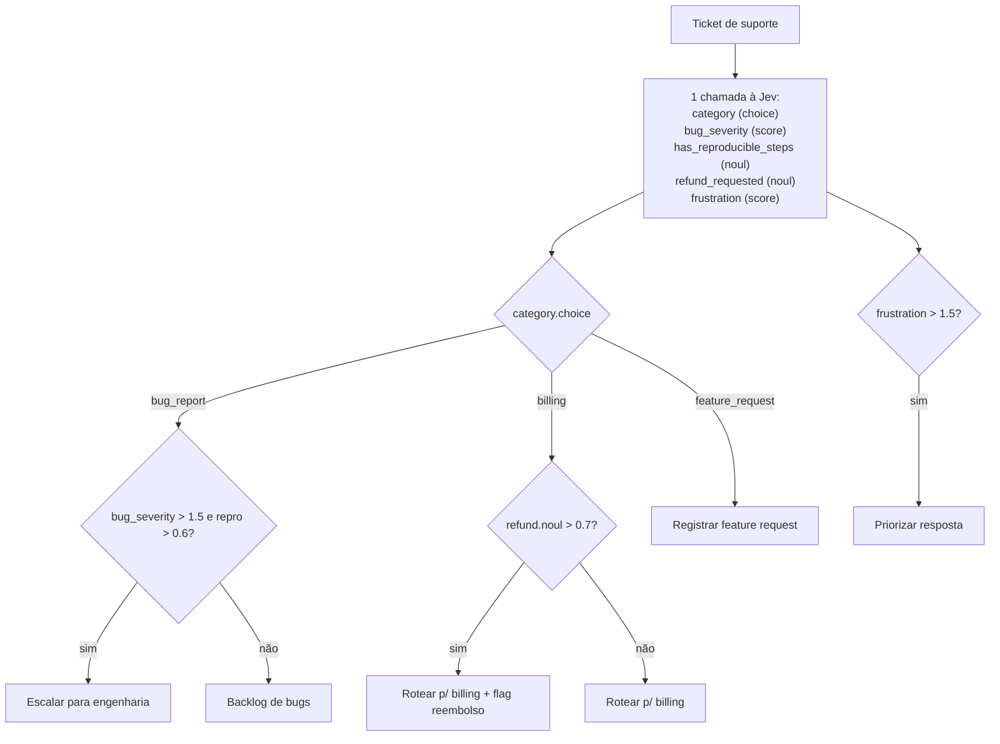
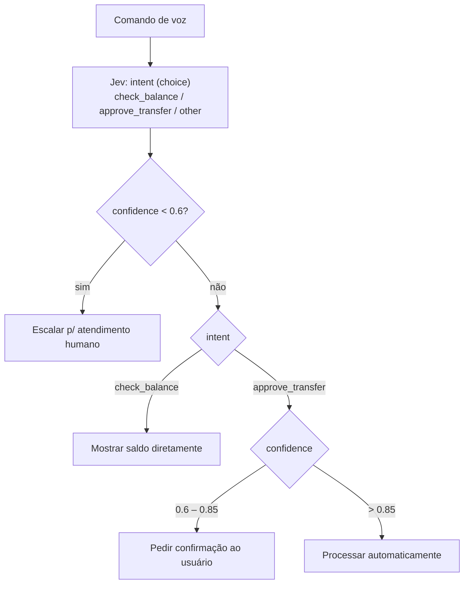
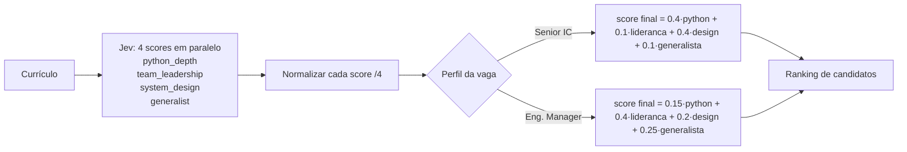
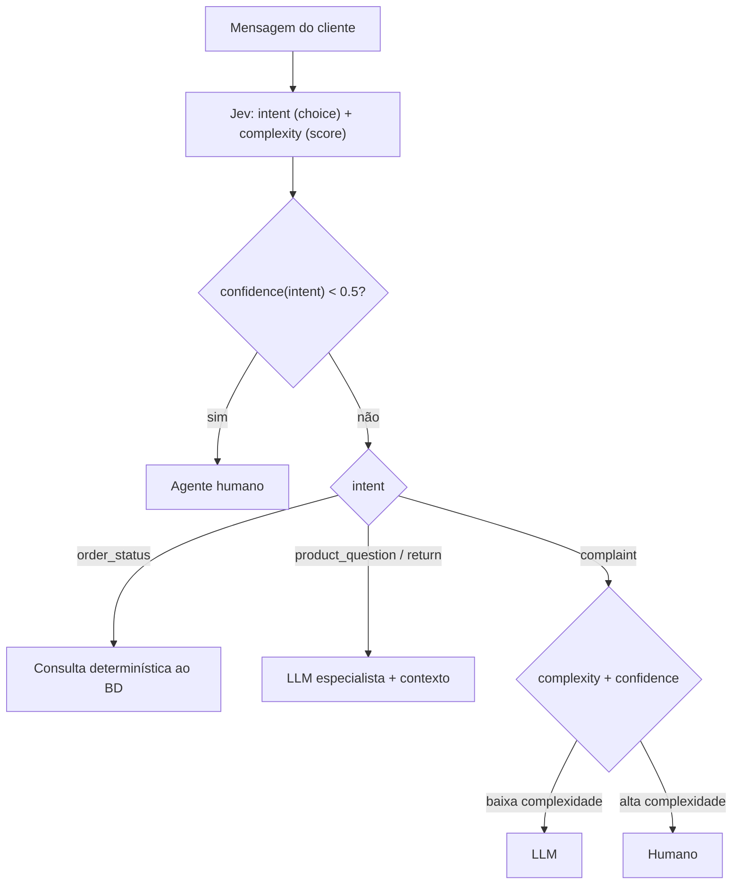

# Referência técnica — Padrões de composição

Parte de [../SKILL.md](../SKILL.md). Fonte principal: [../../05 - Jev Patterns.md](../../study/curated/05%20-%20Jev%20Patterns.md), [study/sources/patterns-index.md](../../study/sources/patterns-index.md) e as páginas individuais de padrões/cookbooks linkadas abaixo.

## Por que padrões de composição importam

O contrato estreito da Jev (latência baixa, previsibilidade, custo baixo) tem uma contrapartida: nenhuma decisão de negócio complexa é resolvida por uma única chamada isolada. Uma decisão real ("esse ticket deve escalar?", "essas duas entidades são o mesmo produto?") quase sempre depende de combinar várias respostas atômicas com lógica determinística em código. "Learning to think in terms of discrete, atomic decisions that compose into complex system behavior is a key skill for getting the most out of TypeSafe."

| Padrão | O que faz | Benefícios |
| --- | --- | --- |
| Speculative Fan-Out | Envia várias perguntas (inclusive especulativas) numa única chamada e deixa o código decidir o que é relevante | Custo, Velocidade |
| Confidence-Gated Routing | Usa a confiança como segundo eixo de decisão para sistemas mais seguros | Confiabilidade, Segurança |
| Composite Scoring | Combina várias dimensões de análise num único score | Custo, Confiabilidade, Velocidade |
| Intent Routing | Classifica a intenção do usuário e roteia para o handler apropriado | Custo, Velocidade |

## 1. Speculative Fan-Out

**Problema:** evitar múltiplas idas e vindas quando uma decisão depende de perguntas condicionais — ex.: "qual a severidade do bug?" só importa se `category == bug_report`. Perguntar sequencialmente multiplica latência e custo.

**Como funciona:** como a Jev avalia todas as perguntas de uma chamada em paralelo, o custo marginal de mais perguntas é baixo. Envie **todas** as perguntas que o sistema pode precisar — inclusive as especulativas — numa única chamada, e deixe o código decidir depois o que é relevante.



```python
category = response.answers["category"]
bug_severity = response.answers["bug_severity"]
bug_repro = response.answers["has_reproducible_steps"]
refund = response.answers["refund_requested"]
frustration = response.answers["frustration"]

if category.choice == "bug_report":
    if bug_severity.score > 1.5 and bug_repro.noul > 0.6:
        escalate_to_engineering(ticket_id, severity="high")
    else:
        add_to_bug_backlog(ticket_id)
elif category.choice == "billing":
    if refund.noul > 0.7:
        route_to_billing_with_flag(ticket_id, refund_likely=True)
    else:
        route_to_billing(ticket_id)
elif category.choice == "feature_request":
    log_feature_request(ticket_id)

if frustration.score > 1.5:
    flag_for_priority_response(ticket_id)
```

Fonte: [study/sources/patterns-fan-out.md](../../study/sources/patterns-fan-out.md).

## 2. Confidence-Gated Routing

**Problema:** ações com consequências muito diferentes (consultar saldo vs. aprovar transferência) não deveriam exigir o mesmo nível de certeza. Um único threshold global é arriscado.

**Como funciona:** a resposta diz **o quê**; a confiança diz **se** deve agir com base nela. Defina thresholds diferentes por ação, proporcionais ao risco:

- Confiança < 0.6 → escalar para atendimento humano.
- `check_balance` com confiança ≥ 0.6 → mostrar saldo diretamente (baixo risco).
- `approve_transfer` entre 0.6–0.85 → pedir confirmação.
- `approve_transfer` acima de 0.85 → processar automaticamente (alto risco exige mais certeza).



Fonte: [study/sources/patterns-confidence-routing.md](../../study/sources/patterns-confidence-routing.md).

## 3. Composite Scoring

**Problema:** julgamentos multidimensionais (avaliar um currículo) não devem virar um único julgamento monolítico do modelo — isso é opaco e impossível de recalibrar sem reprocessar tudo.

**Como funciona:** quebre em dimensões atômicas independentes, peça um `score` para cada, combine com **pesos controláveis em código**. Dá transparência total — se os melhores candidatos não fazem sentido, ajuste os pesos sem perder granularidade.

Exemplo real (triagem de currículos, 4 dimensões 0–4 normalizadas para 0–1):

| Dimensão | Peso — Senior IC | Peso — Engineering Manager |
| --- | --- | --- |
| Profundidade em Python | 40% | 15% |
| Liderança de equipe | 10% | 40% |
| Design de sistemas | 40% | 20% |
| Capacidade generalista | 10% | 25% |



Fonte: [study/sources/patterns-composite-scoring.md](../../study/sources/patterns-composite-scoring.md).

## 4. Intent Routing

**Problema:** processar toda requisição por um handler caro (LLM generativa completa, ou humano) desperdiça custo e velocidade em casos que poderiam ser resolvidos mais barato.

**Como funciona:** a Jev classifica **antes** de qualquer handler qual é a melhor forma de resolver: lógica determinística, LLM especialista, ou humano. Duas perguntas em paralelo: `intent` (choice) e `complexity` (score).

- Confiança de intent < 0.5 → agente humano.
- `order_status` → consulta determinística ao BD.
- Dúvidas de produto/trocas → LLM especialista com contexto relevante.
- Reclamações → complexity + confidence decidem entre LLM ou humano.



Fonte: [study/sources/patterns-intent-routing.md](../../study/sources/patterns-intent-routing.md).

## Demo de referência: Smart Home Assistant

Implementação viva de **Speculative Fan-Out** + fallback para LLM generativo. Para "Turn off all of the lights in the house", 4 perguntas disparam em paralelo (categoria, domínio-alvo, tipo de dispositivo, ação) mesmo antes de confirmar quais são relevantes; irrelevantes são descartadas em código. Dois refinamentos importantes: (1) pedidos compostos (múltiplas ações num único pedido) são divididos por uma LLM antes de avaliar cada comando separadamente; (2) perguntas abertas de informação (não comandos) caím para uma LLM generativa. Confirma o ponto central: **a Jev não substitui LLMs generativas** — resolve o caso comum determinísticamente, empurrando só o genuinamente aberto para um modelo caro. Fonte: [study/sources/demos-smart-home.md](../../study/sources/demos-smart-home.md), [study/sources/demos-index.md](../../study/sources/demos-index.md).

## Cookbooks — receitas prontas

| Cookbook | Problema | Primitivo(s) | Ideia central |
| --- | --- | --- | --- |
| [Self-Consistency: Nouls](../../study/sources/cookbook-consistency-noul.md) | Triagem de sinistros exige probabilidades confiáveis em casos-limite | `noul` | Jev tem variância muito menor (desvio-padrão médio 0.0102) que LLMs padrão — escale só os casos 0.30–0.70 para revisão humana |
| [Self-Consistency: Choices](../../study/sources/cookbook-consistency-choice.md) | Decisões de moderação oscilam entre chamadas repetidas | `choice` | Threshold 0.60 atinge 99.2% de concordância, com 74.2% resolvido automaticamente |
| [Parallel Questions](../../study/sources/cookbook-parallel-questions.md) | Perguntas separadas multiplicam custo/latência | `noul`, `choice`, `score` | Agrupar numa chamada: respostas idênticas, 12.2x menos custo, 10x menos latência |
| [Re-ranking](../../study/sources/cookbook-rerank.md) | BM25 traz shortlist mas ordem está errada | `noul` | BM25 filtra ~30 candidatos; Jev reordena par a par — top-1 accuracy de 5% para 18% |
| [Semantic Find](../../study/sources/cookbook-semantic-find.md) | Buscar dentro de doc grande e saber se a resposta não existe | `choice`, `noul` | `choice` rankeia linhas; `noul` separado confirma existência da resposta |
| [Autoformat](../../study/sources/cookbook-autoformat.md) | Texto colado perdeu formatação Markdown | `noul`, `choice` | 2 passagens: `noul` une linhas; `choice` classifica blocos (título/parágrafo/lista/código) |
| [Function Calling](../../study/sources/cookbook-function-calling.md) | Converter NL em chamadas de função tipadas | `choice`, `noul` | Cada argumento vira uma pergunta; confidence reportada é a do argumento menos certo |
| [Skill Suggestion](../../study/sources/cookbook-skill-suggestion.md) | Agente com 182+ skills erra seleção (descrições truncadas) | `choice`, `noul` | 2 rodadas progressive disclosure: `choice` amplo + 3 `noul` de gate, depois top-3 com descrição completa — reduz erro de 16.8% para 7.3% |
| [Entity Alignment](../../study/sources/cookbook-entity-alignment.md) | Decidir se 2 registros são o mesmo produto | `score`, `noul` | `score` de 3 níveis (diferente/relacionado/mesmo) + `noul`s por campo p/ curadoria |
| [Classifying RAG Passages](../../study/sources/cookbook-classifying-rag-passages.md) | Passagens RAG trazem ruído/contradição | `noul` | Estágio entre retrieval e geração: 4 `noul`s (relevância, evidência, contradição, prompt injection) |
| [Citation Check](../../study/sources/cookbook-citation-check.md) | Verificar se citações de LLM são reais e suportam a afirmação | `choice` | String exata localiza; `choice` classifica supports/contradicts/says_nothing |
| [LLM Guardrails](../../study/sources/cookbook-llm-guardrails.md) | Fronteiras de segurança inconsistentes/vulneráveis | `noul`, `score` | 4 `noul`s de risco + 1 `score` de severidade; roteamento por thresholds configuráveis |
| [SDE Cascade](../../study/sources/cookbook-sde-cascade.md) | Extração de alta qualidade cara se sempre usar modelo forte | `noul` | Cascata: barato extrai → Jev verifica com `noul` de erro → só sinalizados escalam |
| [Date Extraction](../../study/sources/cookbook-date-extraction.md) | Extrair/validar datas absolutas e relativas | `choice` | 7 `choice`s por extração; código resolve em data concreta + confidence |
| [Pre-parsed Value Extraction](../../study/sources/cookbook-pre-parsed-value-extraction.md) | Extrair valores sem risco de alucinação | `choice`, `noul` | Regex localiza candidatos; Jev só escolhe entre eles — nunca inventa |
| [Hierarchical Classification](../../study/sources/cookbook-hierarchical-classification.md) | Classificar em taxonomias profundas sem propagar erro raso | `choice` | Beam search paralelo (K=3) com média geométrica supera top-1 guloso — 4/4 vs 2/4 |
| [Autoresearch Feature Discovery](../../study/sources/cookbook-autoresearch-feature-discovery.md) | Converter texto não-estruturado em features numéricas p/ ML | `score`, `noul` | Loop: propõe perguntas → responde → treina → refina; RMSE de 2.15 para 1.77 em 5 rodadas |
| [Classification using Confidence](../../study/sources/cookbook-classification-using-confidence.md) | Classificar em 75 grupos sem falsa precisão | `choice` | Confiança ≥ 0.9 → grupo específico; abaixo → divisão mais ampla. Em 60 relatórios: acima de 0.9 acerta 90%; abaixo, 40% no grupo e 70% na divisão |

### 3 receitas para copiar direto

**SDE Cascade** — cascata de custo: modelo barato extrai, Jev verifica cada campo com `noul` de probabilidade de alucinação, só os sinalizados escalam para o modelo caro:

```python
questions[f"{name}::hallucinated"] = Noul(
    instructions={...},
    criteria=NoulCriteria(
        true="the value is unsupported by source text",
        false="the value is supported by source text"
    )
)
```

**Pre-parsed Value Extraction** — regex encontra candidatos, Jev só escolhe entre eles (elimina alucinação por construção):

```python
def pick(document: str, candidates: list[str], question: str) -> dict:
    criteria = {c: None for c in candidates} | {NONE: "None of these is the requested value."}
    answer = ts.system_one(
        state=document,
        questions={"pick": Choice(instructions=question, criteria=criteria)},
        model=TYPESAFE_MODEL,
    ).answers["pick"]
    return {"choice": answer.choice, "confidence": answer.confidence}
```

**LLM Guardrails** — confidence-gated routing aplicado à moderação de segurança:

```python
def guard(text: str, side: str, policy_name: str = DEFAULT_POLICY) -> str:
    """Screen a message and route it under a named application policy."""
    result = screen(text, side)
    return route(result["nouls"], result["severity"], POLICIES[policy_name])
```

Fonte de todo o catálogo: [study/sources/cookbook-index.md](../../study/sources/cookbook-index.md). Visão resumida original: [../../05 - Jev Patterns.md](../../study/curated/05%20-%20Jev%20Patterns.md).