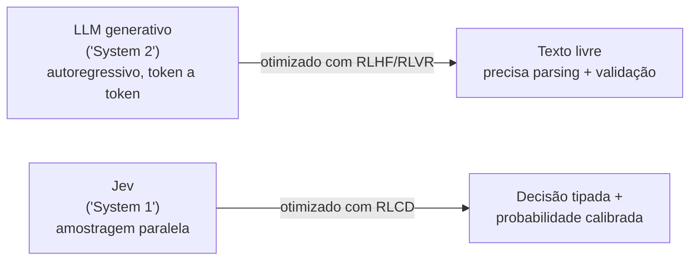
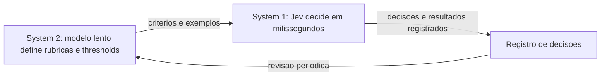
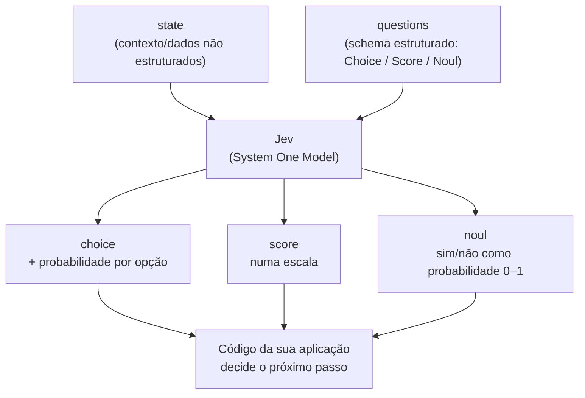

## Visão geral: o problema que motivou a Jev

A tese por trás da Jev nasce de uma pergunta feita por Diogo Almeida, fundador da TypeSafe AI e um dos coautores do método de treinamento (RLHF) que virou a base do ChatGPT: modelos de linguagem já são "sobre-humanos" em conversação há anos — então por que a automação de fato ainda não aconteceu na escala esperada? [Introducing System One Models & Jev](../sources/blog-introducing-system-one-and-jev.md)

Depois de dois anos em stealth, a TypeSafe concluiu que faltava uma peça inteira na pilha: um modelo pensado desde o zero para decisões estruturadas dentro de software, não para diálogo com humanos. Isso levou à criação de uma nova classe de modelo — o **System One Model** — com arquitetura própria, um amostrador paralelo e um método de treino chamado **RLCD**. O primeiro produto público dessa classe é a **Jev**. [Introducing System One Models & Jev](../sources/blog-introducing-system-one-and-jev.md)

A proposta central: pense na Jev como uma "function call de inteligência de fronteira" — entra `state` (contexto não estruturado), sai uma decisão probabilística tipada. Ela abre mão de gerar texto livre, mas em troca ganha velocidade, custo baixíssimo e, segundo a TypeSafe, zero erro de tipo. [Introducing System One Models & Jev](../sources/blog-introducing-system-one-and-jev.md)

## System 1 vs. System 2 — a analogia com Kahneman e o porquê do nome "Jev"

O nome "System One Models" vem diretamente do livro *Thinking, Fast and Slow*, de Daniel Kahneman: a distinção entre o "Sistema 1" — pensamento rápido, intuitivo, automático — e o "Sistema 2" — deliberado, lento, analítico. A documentação da TypeSafe usa essa mesma moldura: LLMs generativos tradicionais (que geram texto token a token, autoregressivamente, de forma sequencial) são tratados como o análogo de raciocínio deliberado, enquanto a Jev foi desenhada para julgamentos rápidos e focados — o "System 1" do software. [System One](../sources/concepts-system-one.md), [Introducing System One Models & Jev](../sources/blog-introducing-system-one-and-jev.md)

A TypeSafe reconhece a nuance: "pensamento Sistema 1" costuma também implicar propensão a erro (vieses, atalhos cognitivos). A empresa afirma — sem detalhar tecnicamente ainda no FAQ capturado — que os System One Models podem ser construídos para ser mais confiáveis que as alternativas, apesar do nome sugerir o contrário. [Introducing System One Models & Jev](../sources/blog-introducing-system-one-and-jev.md)

Já o nome **Jev** homenageia William Stanley Jevons, economista associado ao "Paradoxo de Jevons": quando a eficiência de uma tecnologia aumenta (no caso histórico, a máquina a vapor e o consumo de carvão), a demanda por ela não cai — cresce, porque novos usos antes inviáveis passam a fazer sentido economicamente. A aposta da TypeSafe é que o mesmo vale para inteligência de máquina: cada ordem de magnitude de queda no custo da inteligência libera ordens de magnitude de novos casos de uso de automação. [Introducing System One Models & Jev](../sources/blog-introducing-system-one-and-jev.md)

A documentação de conceitos também enquadra isso como uma aposta estratégica mais ampla, batizada de **"Machine Native Intelligence"**: a maior parte da automação em larga escala não vai envolver uma pessoa lendo a resposta de um modelo, e sim software conversando com software. A TypeSafe estima que a automação em larga escala tenderá a ~99% de interações máquina-a-máquina contra ~1% de interação humana — o que muda o alvo de design de "respostas agradáveis de ler" para "saídas previsíveis o suficiente para o código agir sobre elas". [AI Primer](../sources/introduction-machine-learning-primer.md)

## Como a comunidade usa System 1 + System 2: o loop de calibração

Os dois vídeos mais recentes analisados ([Jev + Claude Code: Architecting the Ultimate Low-Cost Agentic Coding Loop](../sources-youtube/Jev%20_%20Claude%20Code_%20Architecting%20the%20Ultimate%20Low-Cost%20Agentic%20Coding%20Loop.md) e [Jev: Revolutionizing Claude Code and Agentic Workflows with System 1 AI](../sources-youtube/Jev_%20Revolutionizing%20Claude%20Code%20and%20Agentic%20Workflows%20with%20System%201%20AI.md)) convergem numa mesma tese prática: o melhor uso da Jev não é substituir o modelo lento, e sim **combinar os dois**. **[Reportado em vídeo]**

O padrão descrito é um loop de calibração: o modelo lento (System 2) define as rubricas, revisa periodicamente as decisões registradas e reescreve critérios, exemplos e thresholds; a Jev (System 1) roda continuamente em segundo plano tomando as decisões rápidas dentro de `if`-statements. A analogia usada no vídeo A é a de aprender a dirigir: no começo é uma atividade de System 2 (atenção deliberada a espelhos, marchas e sinais); com prática numa rota conhecida vira reflexo de System 1; numa rota desconhecida a tarefa volta para System 2. **[Reportado em vídeo]**

- **Minecraft** (vídeo A): um modelo GPT cuida da estratégia (System 2) e a Jev cuida da tática (System 1), com um modelo controlador executando as entradas físicas. A hierarquia foi: meta do usuário, estratégia do GPT com revisão a cada dois minutos ou após contratempos (como a morte do personagem), tática da Jev e controlador. A entrada da Jev continha metas intermediárias, estado (vida, fome, hora do dia, progresso de mineração), histórico recente de eventos e uma lista de tarefas de múltipla escolha. O experimento terminou no Nether com uma picareta de diamante. **[Reportado em vídeo]**
- **Trading** (vídeo A): a Jev devolve probabilidades e `if`-statements executam compra/venda; um modelo mais profundo revisa estratégia, critérios e thresholds a partir das decisões e resultados registrados. O próprio apresentador trata o trading só como ilustração de tempo real, e outro vídeo do corpus relata resultado ruim nesse uso. **[Reportado em vídeo]**

### Escada de adoção (vídeo B)

O vídeo B organiza os usos em três níveis de adoção: **Nível 1** — agente pessoal (roteamento de modelo e seleção de skill, para reduzir consumo de tokens e latência); **Nível 2** — automações de negócio de alto volume (triagem de e-mails, detecção de fraude em faturas, moderação, triagem de reembolsos, previsão de churn); **Nível 3** — aplicativos novos que só se tornam viáveis pela latência e pelo custo, como busca semântica em bibliotecas de mídia e extensões que classificam o DOM em tempo real. **[Reportado em vídeo]**

O mesmo vídeo traz dois dados de contexto: o post de lançamento do Diogo teria alcançado cerca de 38 milhões de visualizações, e, segundo o vídeo, a tabela de preços coloca a Jev em torno de 24 vezes mais barata que um modelo Haiku e de 230 vezes mais barata que um modelo da classe Sonnet. Os nomes de modelo do resumo automático desse vídeo são inconsistentes com o restante do corpus, então trate a comparação como ordem de grandeza, não como medida. **[Reportado em vídeo]**

## RLCD explicado: o que é e como difere de RLHF/RLVR

A documentação de conceitos descreve três abordagens de pós-treinamento de modelos de linguagem pré-treinados, sendo a terceira a inovação da TypeSafe: [AI Primer](../sources/introduction-machine-learning-primer.md)

- **RLHF** ("Reinforcement Learning from Human Feedback") — transformou modelos pré-treinados em chatbots. Treina o modelo para produzir respostas que pessoas preferem. Foi usado para treinar o InstructGPT e o ChatGPT, e foi co-inventado por Diogo Almeida.
- **RLVR** ("Reinforcement Learning with Verifiable Rewards") — criou os modelos de raciocínio, fortes em tarefas verificáveis como matemática, mas mais lentos e caros.
- **RLCD** ("Reinforcement Learning for Calibrated Decisions") — o caminho de treino da Jev. Treina o modelo para devolver decisões e probabilidades calibradas em vez de texto gerado.

O contrato de saída do RLCD é diferente: o modelo não gera texto; ele devolve decisões e probabilidades; e uma probabilidade maior deve corresponder a uma chance real maior de a resposta estar correta — isto é, calibração. A documentação define calibração de forma precisa: olhando para um grande número de previsões de um modelo bem calibrado, resultados com probabilidade atribuída de 0,2 devem se concretizar em ~20% dos casos, os de 0,8 em ~80%, e os de 1,0 em 100%. Importante: essas taxas descrevem **grupos** de previsões, não garantem que uma resposta individual específica esteja certa. [AI Primer](../sources/introduction-machine-learning-primer.md)

A crítica da TypeSafe ao RLHF é direta: otimizar para "o que as pessoas preferem ouvir" funciona bem para chatbots, mas também pode recompensar bajulação (*sycophancy*) e alucinações que soam confiantes. A otimização por preferência também causa **mode dropping** — o modelo aprende a favorecer um estilo específico (como seguir instruções) reduzindo a probabilidade de outras saídas possíveis — uma versão mais branda do **mode collapse** clássico de GANs, em que um gerador aprende a repetir sempre o mesmo tipo de saída porque ela continua enganando o discriminador. Uma saída pode ser convincente para uma pessoa sem ser confiável o suficiente para automação sem supervisão: preferência humana e confiabilidade para máquina são alvos de otimização diferentes. A posição da TypeSafe não é que RLHF seja ruim — ele continua adequado para modelos conversacionais — mas que automação de produção precisa de um objetivo de treino diferente, centrado em decisões restritas e incerteza calibrada. [AI Primer](../sources/introduction-machine-learning-primer.md)

## Tabela comparativa: LLMs tradicionais vs. System One + Jev

| Aspecto | LLMs tradicionais | System One + Jev |
|---|---|---|
| Otimizado com | RLHF / RLVR | RLCD (Reinforcement Learning for Calibrated Decisions) |
| Otimiza para | Preferência humana: textos/respostas de chat que humanos preferem | Decisões calibradas: probabilidades epistemicamente honestas em tarefas "System One" |
| Entradas | Dados não estruturados, com ênfase em mensagens sequenciais | Dados não estruturados, com ênfase em estado estruturado de programa |
| Saídas | Strings/texto gerado — flexível, mas exige parsing + validação, com risco de "sair dos trilhos" | Valores estruturados type-safe — schema definido previamente, nunca há erro de tipo, sempre há probabilidade/confiança calibrada |
| Amostragem | Sequencial — um token de cada vez, cada um condicionado ao anterior | Paralela — todas as saídas em uma única consulta, otimizada para hardware |
| Custo | Input: US$ 0,20–US$ 10/MTok. Output: ~5x mais caro que o input | Input: US$ 0,042/MTok (US$ 42/bilhão de tokens). Output: GRATUITO |
| Velocidade | Ponta a ponta: 3–329 segundos para modelos de fronteira | Ponta a ponta: 70ms–500ms; 40x–200x mais rápido para consultas no formato "System One" |
| Confiança | Excesso de confiança e inconsistência mesmo quando solicitado a expressar confiança | Sempre comunica confiança/incerteza calibrada; consistente para entradas semelhantes |
| Casos de uso | Humano no loop (chatbots, copilots, agentes de código); problemas verificáveis (provas matemáticas, otimização de kernel); demos | Workflows com IA / "if-statements inteligentes" (classificar, rotear, pontuar, extrair, ramificar); map-reduce sobre grandes volumes de dados; aplicações em tempo real; verificar/guardrail/julgar saídas de LLMs |

Fonte: [Introducing System One Models & Jev](../sources/blog-introducing-system-one-and-jev.md)

**Outras medidas de latência citadas.** A tabela acima traz o número oficial de 70ms–500ms ponta a ponta **[Oficial]**. Os vídeos mais recentes citam faixas próximas: 100–300ms por consulta (vídeo A) e resposta em "menos de um segundo" num prompt de teste (vídeo B), este último sem medição formal **[Reportado em vídeo]**. As medições de vídeo não substituem o número oficial; servem só como corroboração de ordem de grandeza.

## Evidências técnicas

### Demo lado a lado

A TypeSafe fez uma demonstração comparando a Jev com um LLM (GPT-5.6 Terra, em modo de raciocínio padrão) respondendo às mesmas perguntas sobre o mesmo `state`. A diferença mecânica destacada: a Jev devolve todas as probabilidades em paralelo, em vez de gerar token a token de forma autoregressiva. [Introducing System One Models & Jev](../sources/blog-introducing-system-one-and-jev.md)

**Ressalvas explícitas da própria TypeSafe sobre essa demo:** a consulta foi simplificada, com chaves legíveis para humanos; o `state` era um parágrafo curto e denso (o que favorece a Jev); na gravação usada, a única discordância entre Jev e GPT-5.6 Terra foi em "nível de probabilidade de churn" (um caso genuinamente ambíguo); GPT-5.6 Terra com raciocínio padrão foi escolhido como baseline de inteligência mais comparável; e uma demo semelhante foi o que convenceu a própria equipe da TypeSafe a apostar integralmente em System One Models. [Introducing System One Models & Jev](../sources/blog-introducing-system-one-and-jev.md)

### Workflow evals — metodologia e números

A TypeSafe criou um novo tipo de avaliação para medir o quão bem a IA funciona *dentro* de código: parte do princípio de que existe um grafo de computação correto (um "workflow" já escrito em código) e usa como probabilidade de referência a predição dos modelos externos mais inteligentes disponíveis (a média entre "Astra" e "Fable 5.1"), em vez de um rótulo fixo de gabarito — isso para evitar overfitting via engenharia do próprio harness de avaliação. Todo modelo roda o mesmo workflow, e o desempenho é comparado contra essa média dos modelos mais fortes. Resultado reivindicado: a Jev domina a fronteira de Pareto (custo x desempenho) por quase 2 ordens de magnitude. Modelos que tentam fazer toda a lógica via chain-of-thought em um prompt gerado, em vez de usar o workflow estruturado, têm desempenho significativamente pior. Segundo a TypeSafe, essas chamadas de workflow são mais complexas que a demo lado a lado e representativas de cargas de automação de produção reais. Detalhes completos, exemplos e divergências estão hospedados em evals.typesafe.ai (não ingerido nesta base — fora do escopo desta coleta). [Introducing System One Models & Jev](../sources/blog-introducing-system-one-and-jev.md)

Os números publicados na home page da TypeSafe — **193,6x mais rápido e 444,6x mais barato** — vêm exatamente dessa base de workflow evals. A própria TypeSafe adverte que esses números tendem a representar o **extremo superior** dos ganhos esperados no mundo real, não a média típica. [Introducing System One Models & Jev](../sources/blog-introducing-system-one-and-jev.md)

**Ressalvas de viés reconhecidas pela própria TypeSafe:**
- O conteúdo dos workflows não foi deliberadamente construído para favorecer a Jev e não está na distribuição de treino dela — mas foi criado pelo próprio time de "model capabilities" da TypeSafe, o que é um viés potencial reconhecido.
- A resposta de referência é a média entre GPT-6 Astra e Fable 5.1, o que enviesa a referência em direção a OpenAI/Anthropic e provavelmente subestima o desempenho relativo de modelos como os da DeepSeek.
- Os LLMs comparados usam o wrapper próprio da TypeSafe, "System One LLM" (`github.com/typesafe-ai/system-one-adapter-python`), que força os LLMs a devolver decisões estruturadas compatíveis com a API da Jev — a TypeSafe diz que essa é a forma mais precisa de extrair decisões de LLMs, mas reconhece que é mais lenta e mais cara do que pedir decisões sem probabilidades.

[Introducing System One Models & Jev](../sources/blog-introducing-system-one-and-jev.md)

### Alucinação e type-safety

A tese da TypeSafe é que alucinação e type-safety estão intrinsecamente relacionadas, e que type-safety é "pré-requisito básico" ("table stakes") para automação: uma chamada de ferramenta alucinada é inconveniente em um agente conversacional, mas é um "dealbreaker" em sistemas com garantias de latência ou cadeias profundas de dependência. Segundo a TypeSafe, LLMs existentes — não importa quão inteligentes — ainda alucinam e cometem erros de tipo. [Introducing System One Models & Jev](../sources/blog-introducing-system-one-and-jev.md)

**Ressalvas:** os números de alucinação de LLMs citados vêm do OpenRouter (viés potencial — consultas complexas podem ser roteadas para modelos melhores, distorcendo a comparação). Já o "0% de alucinação" atribuído à Jev **não é uma medida empírica** — é uma garantia matemática decorrente do casamento de schema (a saída é sempre validada contra um schema pré-definido, então não pode "sair dos trilhos" estruturalmente). Isso não significa que a Jev sempre acerte a decisão certa — apenas que a estrutura da saída nunca quebra. [Introducing System One Models & Jev](../sources/blog-introducing-system-one-and-jev.md)

A documentação técnica reforça essa distinção com um teste de "jaggedness" do Jev 1.13: o modelo é "extremamente consistente" (saídas quantitativamente parecidas para entradas semanticamente parecidas), mas **não garante invariantes estruturais de senso comum**. Um exemplo documentado: a pergunta "o cliente está pedindo reembolso?" feita como Noul (sim/não probabilístico) devolveu `noul = 0,22`, enquanto a mesma pergunta feita como Choice binária devolveu `yes = 0,01` / `no = 0,99` / `confidence = 0,97` no mesmo ticket — números que não são diretamente comparáveis entre si. Em outro exemplo, uma pergunta e sua negação, feitas como dois Nouls separados, somaram 1,19 em vez de 1,0. A recomendação oficial é não confiar em invariância estrutural entre formulações diferentes da "mesma" pergunta. [Jev 1.13 Jaggedness](../sources/model-jaggedness-jev-1-13.md)

### Demos divertidas

**Doom.** Demonstra inteligência em tempo real combinando código e IA. Rodar 10 consultas por segundo custa cerca de **US$ 7/hora** — um valor mais baixo do que a própria equipe da TypeSafe esperava. A empresa planeja um walkthrough detalhado e eventos no estilo hackathon em torno dessa demo. **Ressalva:** a demo atual usa estado de jogo em texto estruturado, não imagens (ainda); um bot não-IA jogaria melhor tecnicamente, mas o objetivo da demo era testar reatividade a diferentes representações de estado e capacidade de seguir instruções — não desempenho competitivo no jogo. [Introducing System One Models & Jev](../sources/blog-introducing-system-one-and-jev.md)

**Wikiracing.** Navegar de uma página da Wikipédia até uma página-alvo usando apenas links encontrados no caminho — cada passo pode significar escolher entre centenas ou milhares de links. É um bom teste de inteligência-por-segundo e do benefício cumulativo de não alucinar sob escolhas de alta cardinalidade. **Ressalvas:** foi coincidência os desafios 2 e 3 começarem ambos em "Rubber Duck"; os ganhos de velocidade mostrados aqui são menores que em outras demos porque o teste foi feito contra os modos "sem raciocínio" dos LLMs (exceto o Astra no nível de raciocínio mais baixo), para manter a demo assistível — LLMs com raciocínio ativado teriam desempenho bem melhor, e a Jev terminou em menos passos (um indício de maior inteligência, não só velocidade); a Jev suporta cardinalidade de até 255 opções — acima disso, ela usa um sistema em dois estágios (pontuar cada opção independentemente, depois fazer a escolha explícita), o que pode causar lentidão ocasional. [Introducing System One Models & Jev](../sources/blog-introducing-system-one-and-jev.md)

## Use-case map e como construir com System One

A documentação de conceitos da TypeSafe resume cinco grandes categorias de aplicação para System One / Jev: **AI Automation Software** (processamento em segundo plano sem supervisão humana — código no controle do fluxo, não arquivos markdown, enquanto a TypeSafe cuida das decisões semânticas), **Real-time applications** (inteligência de fronteira a ~150ms, rápida o bastante para jogos ou para embutir em UI), **AI Map Reduce over Big Data** (100x mais barato para processar datasets gigantes — busca semântica sobre grandes corpora, classificação de traces de agentes, extração de features), **Universal Verification** (verificar prompt de entrada, extrações, traces de raciocínio ou chamadas de ferramenta de qualquer IA — detectar jailbreaks, erros de citação, alucinações — a uma fração do custo da chamada de LLM original) e **Harness Engineering** (usar consultas à Jev para deixar o harness mais inteligente: roteamento de modelo, recuperação semântica de contexto, detecção de erro/guardrails de LLM, classificação de reasoning traces). [Use Case Map](../sources/concepts-use-case-map.md)

A mesma página lista 19 categorias de automação com exemplos concretos por área — entre elas busca e recuperação (substituir/complementar embeddings em pipelines RAG), descoberta científica (triagem de papers, checagem de citações), roteamento de modelo, guardrails de LLM (detecção de jailbreak/prompt injection), linting semântico de código, extração de features para modelos preditivos, recrutamento, geração de leads, atendimento ao cliente, sinistros de seguro, crime financeiro, jurídico/compliance, marketplaces de e-commerce, moderação e trust & safety, publicidade, gaming, avaliação de risco, previsão de demanda e grafos de conhecimento. Por fim, a página descreve um framework de **dez** tipos de tarefa ("decision shapes"): classificação (um único rótulo conhecido deve vencer), detecção (probabilidade de uma propriedade estar presente), pontuação/scoring (resposta numa rubrica ordenada), roteamento (uma categoria seleciona o próximo caminho de código), busca (encontrar itens que casam com uma query em linguagem natural), recuperação (trazer o contexto/registro mais relevante), ranqueamento (ordenar por relevância semântica), verificação (checar um artefato contra modos de falha específicos), extração de features para ML a jusante e **extração de dados estruturados** (recuperar campos conhecidos a partir de texto não estruturado). [Use Case Map](../sources/concepts-use-case-map.md)

Sobre *como construir* com System One, a filosofia central é: manter o código no controle do fluxo determinístico e dar à Jev apenas decisões estreitas e estruturadas — o oposto do padrão de "agente LLM" que escolhe seus próprios passos (e acumula erro a cada passo). A documentação descreve seis qualidades que tornam o System One eficaz (saídas estruturadas e tipadas, avaliação paralela de perguntas independentes, resultados comparáveis que habilitam lógica condicional em código, execução rápida (~100ms), confiança calibrada via distribuição de probabilidade, e respostas autoconsistentes em chamadas repetidas) e uma metodologia de design em seis passos: (1) manter lógica determinística em código, nunca delegada ao modelo; (2) decompor o `state` de entrada para incluir só o contexto relevante; (3) usar estruturas aninhadas para referenciar valores específicos com clareza; (4) quebrar perguntas complexas em perguntas atômicas e mensuráveis; (5) agrupar perguntas independentes em lote para aproveitar o processamento paralelo; (6) combinar as saídas via lógica de código ou modelos de ML a jusante, roteando casos incertos para revisão. O exemplo completo usado na documentação é um workflow de triagem de tickets de suporte (`triage_ticket.py`) que ilustra o método de ponta a ponta: código trata o caso determinístico (ticket já fechado retorna `no_action` sem chamar o modelo); o `state` enviado à Jev contém apenas os campos relevantes (mensagem, remetente, links do ticket; plano e pedidos em aberto do cliente; lista de credenciais sensíveis da política); e sete perguntas atômicas rodam em paralelo numa única chamada — uma `Choice` (`topic`: billing / orders / account, cada opção descrita com "what"/"not_for"/"examples") e seis `Noul`s binários (`requests_credentials`, `sender_identity_mismatch`, `unexpected_reward`, `refund_requested`, `mentions_open_order`) mais um `Score` de frustração em três níveis. O código então compõe os sinais de spam com pesos explícitos (`0.45 * requests_credentials + 0.30 * sender_identity_mismatch + 0.25 * unexpected_reward`), escala para revisão humana quando o risco fica na faixa incerta (0.4–0.6) ou quando a confiança do `topic` é menor que 0.75, e só depois roteia por billing/orders/prioridade de atendimento — tudo com a lógica de decisão final em código, não no modelo. Esse é o mesmo padrão didático usado na seção de RLCD acima: decompor um julgamento vago ("isso é spam?") em perguntas atômicas específicas, combináveis em código, em vez de depender de um julgamento único e opaco. [How to Build with System One](../sources/concepts-how-to-build-with-system-one.md)

Complementando esse fluxo, a documentação de modelos detalha os limites técnicos práticos de implementação com o Jev 1.13 (`jev-1.13.0`): [Models](../sources/models.md)

| Especificação | Valor |
|---|---|
| Preço | US$ 42 / bilhão de tokens de input (US$ 0,042/MTok); output gratuito |
| Rate limits | 250.000 tokens/segundo; 1.200 requisições/minuto (ajustando dinamicamente conforme demanda) |
| Janela de contexto | 64k tokens por requisição; 32k tokens para `state` + a pergunta mais longa |
| Entrada | Apenas texto — string, objeto JSON ou array de valores de texto; sem imagem, áudio ou vídeo |
| Aliases | `jev-latest` e `jev-preview` apontam para `jev-1.13.0` (sem build preview disponível no momento) |
| Customização | Não há fine-tuning/LoRA por cliente; a mesma versão de pesos atende todas as contas — a customização acontece via `state`, `instructions` e `criteria` na própria chamada |
| Idioma | Inglês tem o melhor desempenho; outras línguas (incl. CJK) são suportadas, mas com qualidade inferior |
| Dados | Jev não é treinada com requisições/respostas de clientes; há DPA, política de privacidade e ZDR para clientes enterprise |

A mesma documentação técnica sobre limitações conhecidas ("jaggedness") do Jev 1.13 lista nove modos de falha documentados pela própria TypeSafe — entre eles: leitura literal demais das instruções, fraqueza em matemática/contagem/precisão numérica, comparação de datas como texto em vez de quantidade ordenada, perda de acurácia com múltiplos saltos de indireção, degradação com `state` grande e cheio de detalhe irrelevante ("context rot"), vulnerabilidade a conteúdo adversarial dentro do próprio `state`, confusão quando instruções e critérios se contradizem, ausência de invariantes estruturais de senso comum (ver exemplos na seção de alucinação acima) e incapacidade de gerar texto livre de forma confiável. Para cada um, a documentação recomenda mitigação — em geral, manter aritmética e lógica determinística em código e usar a Jev apenas para o julgamento semântico estreito. [Jev 1.13 Jaggedness](../sources/model-jaggedness-jev-1-13.md)

## FAQ oficial

**De onde vêm os nomes "System One Models" e "Jev"?**
Inspirado em Daniel Kahneman, *Thinking, Fast and Slow* — a distinção entre o pensamento rápido/intuitivo "Sistema 1" e o deliberado/lento "Sistema 2". "Pensamento Sistema 1" também costuma implicar propensão a erro; a TypeSafe afirma (sem detalhar tecnicamente ainda) que os System One Models podem ser feitos mais confiáveis que as alternativas. "Jev" homenageia William Stanley Jevons — a expectativa é que a inteligência de máquina siga um caminho parecido ao do carvão: a eficiência do motor a vapor aumentou a demanda (Paradoxo de Jevons) — cada ordem de magnitude de queda no custo da inteligência libera ordens de magnitude de novos casos de uso. [Introducing System One Models & Jev](../sources/blog-introducing-system-one-and-jev.md)

**Lacuna conhecida na fonte primária.** As demais perguntas que apareciam no FAQ do blog oficial — "Why was a new training algorithm needed?", "What use cases is Jev good for?", "Is Jev just a smaller LLM?", "How does Jev perform against public benchmarks?", "Where does our training data come from?", e "These results are kinda crazy - how is it possible?" — estavam presentes no HTML da página, mas o conteúdo da resposta estava incompleto ou não carregado no momento da coleta. Essa lacuna está registrada explicitamente no documento-fonte; nenhuma resposta foi inventada para essas perguntas. [Introducing System One Models & Jev](../sources/blog-introducing-system-one-and-jev.md)

## Referências

- [Introducing System One Models & Jev](../sources/blog-introducing-system-one-and-jev.md) — post oficial de lançamento (TypeSafe AI Blog, 15/09/2026)
- [System One](../sources/concepts-system-one.md) — conceito de System One Model (TypeSafe AI Docs)
- [How to Build with System One](../sources/concepts-how-to-build-with-system-one.md) — metodologia de design (TypeSafe AI Docs)
- [Use Case Map](../sources/concepts-use-case-map.md) — categorias de caso de uso (TypeSafe AI Docs)
- [AI Primer](../sources/introduction-machine-learning-primer.md) — RLCD vs. RLHF vs. RLVR (TypeSafe AI Docs)
- [Models](../sources/models.md) — preço, rate limits, aliases do Jev 1.13 (TypeSafe AI Docs)
- [Jev 1.13 Jaggedness](../sources/model-jaggedness-jev-1-13.md) — limitações conhecidas do modelo (TypeSafe AI Docs)
