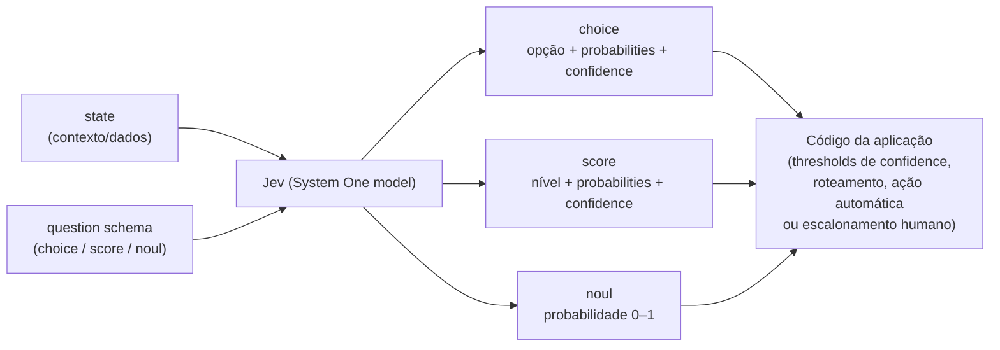

# Jev — State e Primitivos (Choice, Score, Noul) + System One

Este é o documento de referência conceitual central para quem vai desenhar perguntas para a Jev: como estruturar o `state` (o contexto/input) e como escolher entre os três primitivos de pergunta — `choice`, `score` e `noul` — além do conceito "System One" (a categoria de modelo em si) e de como funciona a calibração de confiança (`confidence`).

## 1. O que é "System One" como categoria de modelo

System One é uma classe de modelos de IA construídos para tomar decisões rápidas e estruturadas que o software pode usar diretamente. Um modelo System One avalia um `state` e devolve respostas tipadas e probabilidades — a Jev é o modelo "flagship" da TypeSafe e o primeiro System One model ([System One](../sources/concepts-system-one.md)).

O nome "System One" vem do conceito popularizado por Daniel Kahneman em *Thinking, Fast and Slow*: o "Sistema 1" é o pensamento rápido e intuitivo, em oposição ao "Sistema 2", mais lento e deliberado. A ênfase aqui é em julgamentos rápidos e focados ([System One](../sources/concepts-system-one.md)).

### Diferença de um LLM genérico

Assim como um LLM, um modelo System One entende input em linguagem natural. Mas ele **não escreve respostas, não produz código e não gera explicações do seu próprio raciocínio** — em vez de texto livre, ele devolve decisões tipadas e probabilidades, dentro de um espaço de respostas que você define via os primitivos (`choice`, `score`, `noul`) ([System One](../sources/concepts-system-one.md)).

Modelos System One são treinados para **decisões calibradas**: suas probabilidades são otimizadas contra os resultados reais, para refletir incerteza. A calibração é medida através de grupos de previsões — ela não garante que uma resposta individual isolada esteja correta ([System One](../sources/concepts-system-one.md)). Esse treinamento é feito via RLCD (Reinforcement Learning for Calibrated Decisions), conforme já documentado em [01 - Jev Use Cases](./01%20-%20Jev%20Use%20Cases.md).

Atualmente, a Jev aceita apenas input de texto: strings, objetos JSON e arrays de texto. Imagens, áudio e vídeo ainda não são suportados ([System One](../sources/concepts-system-one.md)).

### Diferença de um classificador tradicional

Um classificador tradicional tipicamente devolve uma única classe (ou, no máximo, uma distribuição de probabilidade fixa sobre um conjunto de classes pré-treinado). A Jev, por ser um modelo generalista treinado sobre linguagem natural, permite que o *schema* de decisão (as opções de `choice`, os níveis de `score`, a proposição de `noul`) seja definido dinamicamente a cada chamada, sem re-treinamento — e devolve não só a decisão, mas a distribuição de probabilidade completa e uma métrica de `confidence` derivada dela ([Primitives (Questions)](../sources/primitives-index.md), [Confidence](../sources/confidence.md)).

### Julgamentos rápidos dentro de um workflow maior

Para um caso como um pedido de reembolso, a aplicação pode:

1. Construir um `state` contendo a mensagem do cliente, as transações relevantes e a política de reembolso.
2. Perguntar, de forma independente e simultânea, se um reembolso foi solicitado, se a evidência indica uma cobrança duplicada, e se a política dá suporte ao reembolso.
3. Combinar as respostas com checagens determinísticas no código, e então rotear o caso para ação automática ou revisão humana.

Como os modelos System One devolvem saídas tipadas e restritas (em vez de texto livre), o código da aplicação consegue inspecionar e combinar as respostas em fluxos previsíveis ([System One](../sources/concepts-system-one.md)).

## 2. O `state`: como estruturar o contexto/input

`state` é o conteúdo que você pede para um modelo System One avaliar — a matéria-prima factual sobre a qual as perguntas (`questions`) serão feitas. Você passa `state` junto com as perguntas numa única chamada de API, e cada requisição avalia um único `state` contra uma ou mais perguntas, de forma independente ([State](../sources/concepts-state.md)).

### Formatos aceitos

`state` pode ser uma string simples ou um valor JSON estruturado (objeto ou array):

```python
state = "My card was charged twice."
```

| Formato | Útil para | Exemplo |
| --- | --- | --- |
| String | Uma mensagem, artigo ou passagem de texto | `"My card was charged twice."` |
| Object | Campos nomeados, registros relacionados, ou estado da aplicação | `{"message": "My card was charged twice.", "order_id": "A-104"}` |
| Array | Uma sequência de mensagens ou registros | `["Hi", "My customer number is TS1337.", "My card was charged twice."]` |

Exemplo de um `state` mais complexo, representando um ticket de suporte inteiro, com dados relacionados (a mensagem, o pedido, a política):

```json
{
  "ticket": {
    "subject": "Duplicate charge",
    "messages": [
      {"from": "customer", "text": "I was charged twice for order A-104. Please refund the duplicate."},
      {"from": "support", "text": "We are checking the charges."}
    ]
  },
  "order": {
    "id": "A-104",
    "charges": [
      {"amount_usd": 49, "status": "captured"},
      {"amount_usd": 49, "status": "captured"}
    ]
  },
  "refund_policy": "Duplicate charges are eligible for a refund."
}
```

([State](../sources/concepts-state.md))

### Separe conteúdo (state) de julgamento (questions)

A recomendação central da documentação é manter os fatos e o conteúdo de apoio dentro de `state`, e definir os julgamentos que você quer que o modelo faça como `questions` separadas. Essa separação é o que permite reutilizar o mesmo `state` para múltiplas perguntas independentes numa única chamada — e é a base de todo o desenho de schema descrito nas seções seguintes ([State](../sources/concepts-state.md), [Primitives (Questions)](../sources/primitives-index.md)).

### Definindo uma pergunta

Toda pergunta (`question`) precisa de quatro componentes: um **ID** (a chave sob a qual a resposta virá), um **`type`** (`choice`, `score` ou `noul`), **`instructions`** (o texto da pergunta) e **`criteria`** (o espaço de respostas possíveis — o schema em si). As instruções devem declarar claramente a pergunta completa:

```python
from typesafe_sdk import Noul

questions = {
    "refund_requested": Noul(
        instructions="Does the customer request a refund?",
    ),
}
```

([Primitives (Questions)](../sources/primitives-index.md))

Quando o `state` é um objeto estruturado, você pode referenciar campos específicos dentro de `instructions` usando caminhos com ponto/índice entre crases, para direcionar a atenção do modelo:

```python
questions = {
    "refund_requested": {
        "type": "noul",
        "instructions": "Does `ticket.messages[0].text` request a refund?",
    },
    "policy_supports_refund": {
        "type": "noul",
        "instructions": (
            "Does `refund_policy` support the refund requested "
            "in `ticket.messages[0].text`, given `order.charges`?"
        ),
    },
}
```

([Primitives (Questions)](../sources/primitives-index.md))

## 3. Os três primitivos de pergunta

A regra geral de desenho é: **peça um único julgamento instantâneo por pergunta** — algo que uma pessoa com o contexto adequado conseguiria decidir na hora. Se uma avaliação depende de vários fatores independentes, pergunte cada fator separadamente e combine as respostas programaticamente, em vez de pedir uma análise abrangente numa única pergunta ([Primitives (Questions)](../sources/primitives-index.md)).

### 3.1 `choice`

**Definição.** Choice é o primitivo para selecionar uma opção entre um conjunto fixo e não-ordenado. A resposta inclui a opção escolhida (`choice`), a distribuição de probabilidade entre todas as opções (`probabilities`) e uma métrica de confiança (`confidence`) ([Choice](../sources/primitives-choice.md)).

**Quando usar.** Roteamento, classificação, detecção de idioma, ou qualquer decisão onde as opções não têm uma ordem natural entre si (diferente de `score`).

**Schema de request:**

```json
{
  "state": "My running shoes arrived in the wrong size. Can I swap them for a size 10?",
  "selectedModels": ["jev-latest"],
  "questions": {
    "department": {
      "type": "choice",
      "instructions": "Which team should handle this?",
      "criteria": {
        "returns": "Exchanges, wrong or damaged items",
        "shipping": "Delivery status, delays, lost packages",
        "billing": "Charges, invoices, payment problems"
      }
    }
  }
}
```

**Exemplo em Python SDK:**

```python
from typesafe_sdk import Choice, TypeSafeClient

with TypeSafeClient() as client:
    response = client.system_one(
        state="My running shoes arrived in the wrong size. Can I swap them for a size 10?",
        questions={
            "department": Choice(
                instructions="Which team should handle this?",
                criteria={
                    "returns": "Exchanges, wrong or damaged items",
                    "shipping": "Delivery status, delays, lost packages",
                    "billing": "Charges, invoices, payment problems",
                },
            ),
        },
    )

    print(response.answers["department"].choice)
```

**Formato de resposta:**

```json
{
  "model": "jev-1.13.0",
  "answers": {
    "department": {
      "type": "choice",
      "choice": "returns",
      "confidence": 1.0,
      "probabilities": {
        "shipping": 0.0,
        "returns": 1.0,
        "billing": 0.0
      }
    }
  },
  "usage": {
    "input_tokens": 328,
    "output_tokens": 34
  }
}
```

([Choice](../sources/primitives-choice.md))

**Estruturando as opções.** Quando opções se confundem, é possível trocar a descrição simples em string por um objeto com campos como `what` (o que cobre), `not_for` (o que não cobre) e `examples`:

```json
{
  "return_topic": {
    "type": "choice",
    "instructions": {
      "question": "Which returns topic is the customer asking about?",
      "focus": "Classify the information the customer wants."
    },
    "criteria": {
      "return_policy": {
        "what": "Whether and how an item can be returned",
        "not_for": "Progress of a return already sent",
        "examples": ["Can I return shoes I've worn once?", "How long do I have to return an order?"]
      },
      "return_status": {
        "what": "Progress of a return already sent",
        "not_for": "Whether and how an item can be returned",
        "examples": ["Has my return arrived yet?", "When will my refund be paid?"]
      }
    }
  }
}
```

([Choice](../sources/primitives-choice.md))

**Caso de uso típico:** triagem de tickets de suporte — decidir para qual equipe (`returns`, `shipping`, `billing`) rotear uma mensagem, combinando `choice.department` com outras perguntas especulativas (`return_reason`, `shipping_issue`, `tone`) na mesma chamada, e usando `confidence` para decidir se a triagem é automática ou vai para revisão manual ([Choice](../sources/primitives-choice.md)).

### 3.2 `score`

**Definição.** Score avalia conteúdo numa escala ordenada com níveis descritivos (2 a 10 níveis, numerados de 0 em diante). A resposta inclui um `score` numérico (pode cair entre níveis, como decimal), a distribuição de probabilidade entre os níveis (`probabilities`), um `legend` (mapa de nível → descrição) e uma `confidence` ([Score](../sources/primitives-score.md)).

**Quando usar.** Quando existe uma ordem natural entre as respostas possíveis e cada ponto da escala tem um significado definido — por exemplo, severidade de bug, nível de frustração do cliente, formalidade de um texto.

**Schema de request:**

```json
{
  "state": "The export button crashes the settings page in Safari. It works in Chrome, but a few of our customers only use Safari.",
  "model": "jev-latest",
  "questions": {
    "bug_severity": {
      "type": "score",
      "instructions": "How severe is the reported issue?",
      "criteria": [
        "Cosmetic; no impact to functionality",
        "Broken or degraded feature, but workaround exists",
        "Blocking issue; no workaround exists"
      ]
    }
  }
}
```

**Exemplo em Python SDK:**

```python
from typesafe_sdk import Score, TypeSafeClient

with TypeSafeClient() as client:
    response = client.system_one(
        state="The export button crashes the settings page in Safari. It works in Chrome, but a few of our customers only use Safari.",
        questions={
            "bug_severity": Score(
                instructions="How severe is the reported issue?",
                criteria=[
                    "Cosmetic; no impact to functionality",
                    "Broken or degraded feature, but workaround exists",
                    "Blocking issue; no workaround exists",
                ],
            ),
        },
    )
    print(response.answers["bug_severity"].score)
```

**Formato de resposta:**

```json
{
  "model": "jev-1.13.0",
  "answers": {
    "bug_severity": {
      "type": "score",
      "score": 1.43,
      "confidence": 0.35,
      "legend": {
        "0": "Cosmetic; no impact to functionality",
        "1": "Broken or degraded feature, but workaround exists",
        "2": "Blocking issue; no workaround exists"
      },
      "probabilities": {
        "0": 0.0,
        "1": 0.57,
        "2": 0.43
      }
    }
  },
  "usage": {
    "input_tokens": 332,
    "output_tokens": 18
  }
}
```

Um score de 1.43 indica posicionamento entre os níveis 1 e 2 (57% de probabilidade no nível 1, 43% no nível 2) — dois `state`s diferentes podem gerar o mesmo `score` numérico com distribuições de probabilidade bem diferentes, por isso os dois valores (`score` + `probabilities`/`confidence`) devem ser lidos juntos ([Score](../sources/primitives-score.md)).

**Boas práticas para os níveis:** usar descrições concretas ("broken feature, but workaround exists") em vez de abstratas ("moderadamente severo"); manter uma única dimensão por pergunta (misturar dimensões reduz a confiança); usar 3 a 10 níveis — o modelo não vê o número de um nível nem seus vizinhos, então descrever apenas com números ("0", "1", "2") faz o modelo não ter nada para comparar e a `confidence` cai. Para casos em que o modelo pontua consistentemente entre dois níveis adjacentes, é possível estruturar cada nível como um objeto com `what` + `examples` — exemplos relevantes concentram a probabilidade corretamente, exemplos irrelevantes não ajudam. A tabela abaixo compara três versões do mesmo nível para o ticket "exportar trava no Safari":

| Descrição do nível | `score` | `confidence` |
| --- | --- | --- |
| String simples, sem objeto com exemplos | 1.43 | 0.35 |
| Array de exemplos com um exemplo útil: "export fails in one browser but works in another" | 1.03 | 0.96 |
| Array de exemplos com um exemplo não relacionado: "search fails, but browsing categories still works" | 1.43 | 0.35 |

O exemplo que corresponde ao caso real concentra quase toda a probabilidade num nível; o exemplo não relacionado devolve o mesmo resultado que as strings simples. Uma `confidence` mais alta não comprova que a resposta está correta — escolha exemplos com níveis esperados conhecidos e teste as descrições revisadas em entradas separadas antes de manter a mudança ([Score](../sources/primitives-score.md)).

**Caso de uso típico:** priorização de bug reports — combinar `severity`, `frustration` e `report_quality` (três Score independentes) numa única chamada, normalizar cada score para 0–1, e calcular uma prioridade ponderada em código:

```python
def normalized(answers, question_id: str) -> float:
    top_level = len(TRIAGE_QUESTIONS[question_id].criteria) - 1
    return answers[question_id].score / top_level

def priority(ticket: str) -> float:
    ...
    severity = normalized(answers, "severity")
    frustration = normalized(answers, "frustration")
    report_quality = normalized(answers, "report_quality")
    return 0.6 * severity + 0.3 * frustration + 0.1 * report_quality
```

([Score](../sources/primitives-score.md))

### 3.3 `noul`

**Definição.** Noul avalia uma proposição de sim/não e retorna uma **probabilidade contínua entre 0 e 1** de que a resposta seja "sim" — não uma nota numa escala. Diferente de `choice` e `score`, respostas `noul` não têm um campo `confidence` separado, porque uma distribuição binária já é totalmente descrita pelo próprio valor de `noul` ([Noul](../sources/primitives-noul.md)).

**Quando usar.** Julgamentos binários onde a própria probabilidade carrega sinal útil — por exemplo, "o cliente está pedindo para falar com um humano?", "essa mensagem contém dados pessoais?", "esse currículo é da mesma pessoa que esse registro?".

**Schema de request:**

```json
{
  "state": "I have asked three times now. Can I please just talk to a real person?",
  "selectedModels": ["jev-latest"],
  "questions": {
    "is_human_escalation": {
      "type": "noul",
      "instructions": "Is the customer asking for a human agent?"
    },
    "is_repeat_contact": {
      "type": "noul",
      "instructions": "Has the customer contacted support about this before?",
      "criteria": {
        "true": "Mentions a prior attempt, ticket, or that they have asked before",
        "false": "No sign of any previous contact"
      }
    }
  }
}
```

**Formato de resposta:**

```json
{
  "model": "jev-1.13.0",
  "answers": {
    "is_human_escalation": {
      "type": "noul",
      "noul": 0.99
    },
    "is_repeat_contact": {
      "type": "noul",
      "noul": 0.93
    }
  },
  "usage": {
    "input_tokens": 360,
    "output_tokens": 39
  }
}
```

Valores perto de 1 indicam afirmação forte, perto de 0 indicam negação forte, e perto de 0.5 indicam incerteza genuína ([Noul](../sources/primitives-noul.md)).

A tabela abaixo mostra respostas registradas do `jev-1.13.0` à pergunta `is_human_escalation` para diferentes mensagens de cliente:

| State | `noul` |
| --- | --- |
| Thanks, that fixed it! | 0.02 |
| How do I reset my password? | 0.07 |
| I need this sorted today, whatever it takes. | 0.26 |
| Are you a bot? | 0.40 |
| Is there any way to speak to someone about my invoice? | 0.84 |
| I have asked three times now. Can I please just talk to a real person? | 0.99 |

"I need this sorted today" é urgente mas nunca pede uma pessoa, e recebe 0.26. "Are you a bot?" sugere querer um humano sem pedir diretamente, e o modelo divide quase igualmente em 0.40 — exatamente o tipo de mensagem em que a decisão de rotear depende de um threshold no código ([Noul](../sources/primitives-noul.md)).

**Noul não é uma escala do que você perguntou.** É a probabilidade de que a resposta seja "sim". Se a pergunta é realmente sobre grau (ex.: nível de experiência), o valor de `noul` não mede esse grau — para isso, use `score`. O exemplo abaixo compara `noul` ("Is the candidate strong in Python?") com `score` ("How much Python experience does the candidate have?") para quatro candidatos:

| Candidate | Noul: "Is the candidate strong in Python?" | Score: "How much Python experience does the candidate have?" |
| --- | --- | --- |
| My experience is in Java and Go. I have not used Python. | 0.03 | 0.0 (No experience) |
| I have used Python occasionally for small scripts alongside my main Java work. | 0.14 | 1.0 (Some familiarity) |
| I used Python every day for two years in my last job, mostly data pipelines. | 0.81 | 2.05 (Regular use in a job) |
| I have written Python daily for eight years, including maintaining a large Django codebase. | 0.92 | 2.89 (Deep expertise) |

O Noul julga uma única proposição ("strong") e o valor é quão provável ela é — um valor médio pode significar experiência mediana ou um caso ambíguo, e o espaçamento entre candidatos não é algo que você escolheu. Já o Score julga cada nível descrito separadamente, então cada candidato cai perto de um nível que você escreveu, e as `probabilities` mostram como o modelo dividiu seu julgamento entre níveis ([Noul](../sources/primitives-noul.md)).

**Boas práticas de escrita:** peça uma única condição sim/não por Noul; formule a pergunta de forma que valores altos signifiquem "sim" (prefira "Does the message contain personal data?" a "Is the message free of personal data?"); use `criteria.true`/`criteria.false` quando a fronteira entre sim e não for ambígua ([Noul](../sources/primitives-noul.md)).

**Threshold em código.** Como não há `confidence` separado, o padrão recomendado é definir dois limiares (ex.: `NO = 0.2`, `YES = 0.8`) e tratar tudo entre eles como incerto — mandando para revisão humana:

```python
YES = 0.8
NO = 0.2

def route(message: str) -> None:
    ...
    wants_human = answers["is_human_escalation"].noul
    repeat = answers["is_repeat_contact"].noul

    if NO < wants_human < YES or NO < repeat < YES:
        send_to_review(message)
        return

    priority = "high" if repeat > YES else "normal"
    if wants_human > YES:
        route_to_agent(message, priority=priority)
    else:
        route_to_bot(message, priority=priority)
```

([Noul](../sources/primitives-noul.md))

**Caso de uso típico:** detecção de duplicatas — comparar um novo registro contra vários candidatos, cada um como uma pergunta `noul` separada com `instructions` estruturado (`potential_duplicate` + `question`), e filtrar por `noul > 0.7`:

```python
def find_duplicates(resume: dict, candidates: list[dict]) -> list[str]:
    ...
    return [
        question_id
        for question_id, answer in response.answers.items()
        if answer.noul > 0.7
    ]
```

([Noul](../sources/primitives-noul.md))

## 4. Tópicos avançados de primitivos

### Perguntas em lote (batching) numa única chamada

Todas as perguntas que usam o mesmo `state` podem — e devem — ser agrupadas numa única requisição, misturando livremente `choice`, `score` e `noul`. Como os modelos System One processam as perguntas em paralelo, perguntas adicionais são quase gratuitas: apenas a contagem de tokens delas é somada ao custo da chamada.

```python
from typesafe_sdk import Choice, Noul, Score, TypeSafeClient

state = {
    "ticket_message": "My flight was cancelled. Can I get a refund?",
    "refund_policy": "Cancelled flights are eligible for a full refund.",
}

with TypeSafeClient() as client:
    response = client.system_one(
        state=state,
        questions={
            "refund_requested": Noul(instructions="Does `ticket_message` request a refund?"),
            "request_type": Choice(
                instructions="What is the main request in `ticket_message`?",
                criteria={
                    "refund": "The customer wants money returned.",
                    "rebooking": "The customer wants a replacement flight.",
                    "information": "The customer is asking for information only.",
                },
            ),
            "frustration": Score(
                instructions="How frustrated does the customer appear in `ticket_message`?",
                criteria=["Calm and neutral.", "Concerned but civil.", "Very angry or using strong language."],
            ),
        },
    )
```

([Primitives (Questions)](../sources/primitives-index.md))

### Fan-out especulativo

Uma técnica recomendada é incluir na mesma chamada **todas** as perguntas que o código pode vir a precisar — mesmo as condicionalmente relevantes — e deixar a lógica da aplicação decidir quais respostas usar, dependendo de outros resultados. Segundo a documentação, esse padrão de "speculative fan-out" traz ganhos de eficiência grandes: 13 perguntas agrupadas custam cerca de 11,5x menos e executam 9,6x mais rápido do que 13 chamadas separadas ([Primitives (Questions)](../sources/primitives-index.md)).

Um exemplo de fan-out com cinco perguntas `choice` correlacionadas sobre o mesmo ticket ambíguo (`department`, `return_reason`, `shipping_issue`, `requested_resolution`, `tone`) mostra como perguntas como `shipping_issue` só importam quando `department.choice == "shipping"` — o código filtra em runtime com base na resposta de `department` ([Choice](../sources/primitives-choice.md)):

```python
department = answers["department"]
if department.confidence < 0.3:
    send_to_manual_triage(ticket)
    return

if department.choice == "returns":
    assign(ticket, team="returns", issue=answers["return_reason"].choice)
elif department.choice == "shipping":
    assign(ticket, team="shipping", issue=answers["shipping_issue"].choice)
else:
    assign(ticket, team="billing")
```

### Dividir julgamentos complexos em várias perguntas

Em vez de pedir uma única pergunta multidimensional (o que reduz a `confidence`), decomponha o julgamento em várias perguntas de uma dimensão cada — um `score` por fator, por exemplo — e combine os resultados no código da aplicação com pesos ajustáveis sem precisar reescrever os prompts ([Primitives (Questions)](../sources/primitives-index.md), [Score](../sources/primitives-score.md)).

### Quando uma pergunta depende de outra

Perguntas dentro da mesma requisição são avaliadas de forma independente — a resposta de uma não informa a outra dentro da mesma chamada. Quando existe uma dependência genuína (a resposta de uma pergunta precisa determinar que dado buscar, ou quais opções oferecer na pergunta seguinte), é necessário fazer uma segunda chamada. Caso contrário, prefira sempre perguntar tudo de uma vez e filtrar no código ([Primitives (Questions)](../sources/primitives-index.md)).

### Estrutura em `instructions` e `criteria`

Os campos `instructions` (em `choice`, `score`, `noul`) e `criteria` (valores de `choice`, entradas de `score`, `true`/`false` de `noul`) aceitam não só `string`, mas também `object`, `array` ou `null`. Isso é útil para (a) melhorar clareza em perguntas multi-parte e (b) incorporar dados já existentes, como schemas ou registros de banco:

| Campo | Aplica-se a | Formato aceito |
| --- | --- | --- |
| `instructions` | Choice, Score, Noul | `string`, `object`, `array`, ou `null` |
| `criteria` (valores) | Choice | `string`, `object`, `array`, ou `null` |
| `criteria` (entradas) | Score | `string`, `object`, `array`, ou `null` |
| `criteria.true` e `criteria.false` | Noul | `string`, `object`, `array`, ou `null` |

([Advanced: structure](../sources/primitives-advanced.md))

### Cardinalidade alta e taxonomias

Uma pergunta `choice` aceita até 255 opções, e cada opção adicional custa apenas alguns tokens — por isso vale dar ao modelo a lista completa de times, categorias ou produtos em vez de uma lista reduzida, e adicionar uma opção `other`/`none of the above` quando a lista pode não cobrir todas as entradas ([Choice](../sources/primitives-choice.md)).

Para classificar dentro de uma taxonomia profunda, a técnica recomendada é "caminhar" pela árvore com perguntas `choice` sequenciais: em cada passo as opções são os filhos do nó atual, e o valor de cada opção é a subrvore daquele filho — isso deixa o modelo ver o que existe abaixo de um ramo antes de se comprometer com ele. O exemplo abaixo classifica um produto ("garrafa plástica com tampa flip straw") mostrando departamentos e suas subrvores completas:

```json
{
  "state": "32oz plastic bottle with a flip straw lid. Fits most bike cages.",
  "selectedModels": ["jev-latest"],
  "questions": {
    "department": {
      "type": "choice",
      "instructions": "Which top-level department does this product belong to?",
      "criteria": {
        "Sporting Goods": {
          "Cycling": ["Bike Bottles & Cages", "Bike Lights", "Helmets"],
          "Fitness": ["Yoga Mats", "Resistance Bands"],
          "Outdoor": ["Tents", "Sleeping Bags", "Hydration Packs"]
        },
        "Home & Kitchen": {
          "Drinkware": ["Water Bottles", "Travel Mugs", "Tumblers"],
          "Cookware": ["Pots & Pans", "Bakeware"]
        },
        "Baby & Toddler": ["Sippy Cups", "Bottle Warmers", "Bibs"]
      }
    }
  }
}
```

A garrafa se encaixa plausivelmente em dois departamentos; mostrar as subrvores deixa o modelo perceber que tanto `Sporting Goods > Cycling > Bike Bottles & Cages` quanto `Home & Kitchen > Drinkware > Water Bottles` existem, e pesar a ênfase do anúncio em suportes de bike contra artigos genéricos de cozinha. As `probabilities` da resposta indicam se a divisão é próxima o suficiente para explorar os dois ramos. Uma vez escolhido um departamento, pergunte o próximo `choice` com os filhos daquele departamento como opções, repetindo até chegar a uma folha — em código, isso pode ser um loop sobre um dict aninhado, onde o `criteria` de cada pergunta é simplesmente o nó atual ([Advanced: structure](../sources/primitives-advanced.md)).

## 5. Confidence e calibração

`confidence` é uma métrica de 0 a 1, **derivada automaticamente da distribuição de probabilidades** já presente nas respostas `choice` e `score` (não existe em `noul`, cuja probabilidade única já carrega essa informação). O desenvolvedor não precisa calcular essa métrica manualmente, mas o array completo `probabilities` continua disponível para métricas customizadas específicas de domínio ([Confidence](../sources/confidence.md)).

### "Não sei" como sinal útil

A documentação enfatiza que um sistema confiável — humano ou artificial — precisa conseguir expressar incerteza honesta. Ao embutir `confidence` nativamente na resposta, a Jev permite que o código adapte seu comportamento ao nível de certeza, em vez de tratar toda resposta como definitiva ([Confidence](../sources/confidence.md)).

### Três faixas de ação

A recomendação é dividir o uso de `confidence` em três faixas:

- **Alta confiança** → agir automaticamente, sem intervenção.
- **Confiança média** → agir com cautela (confirmação do usuário, sinalizar para revisão, buscar mais informação).
- **Baixa confiança** → não agir; escalar para um humano, pedir esclarecimento, ou usar um sistema de fallback (por exemplo, um modelo de raciocínio/LLM "Sistema 2").

Os limiares exatos dependem do contexto operacional e do risco aceitável, e devem ser testados contra dados reais do domínio antes do deploy ([Confidence](../sources/confidence.md)).

### Os limiares escalam com o risco

Dentro do mesmo sistema, o limiar de confiança deve variar conforme a severidade da consequência: operações de baixo risco (ex.: mostrar um saldo) toleram confiança mais baixa; ações de alto impacto e difícil reversão (ex.: aprovar uma transferência) exigem confiança mais alta antes de agir sem confirmação:

```python
action = response.answers["action"]
confidence = action.confidence

if confidence < 0.5:
    # Modelo genuinamente incerto. Não chutar.
    route_to_human(user_message)

elif action.choice == "check_balance":
    # Baixo risco. Mostrar a tela errada é recuperável.
    show_balance(account_id)

elif action.choice == "approve_transfer":
    if confidence > 0.9:
        # Alto risco, alta confiança. Prossegue com confirmação.
        confirm_then_execute(account_id)
    else:
        # Alto risco, confiança moderada. Verifica antes.
        ask_user_to_confirm(account_id)
```

([Confidence](../sources/confidence.md))

### Relação com "near-0.5 = incerteza"

Em `noul`, um valor próximo de 0.5 significa literalmente que o modelo vê chance quase igual de sim e de não — a incerteza é o próprio valor central da escala, não um terceiro estado separado. Em `score`, a incerteza aparece como probabilidade espalhada entre vários níveis adjacentes (uma `confidence` baixa), independentemente de qual seja o `score` numérico resultante — dois `state`s podem produzir o mesmo `score` com `confidence` bem diferente, e isso só é visível olhando a distribuição completa de `probabilities` ([Score](../sources/primitives-score.md), [Noul](../sources/primitives-noul.md), [Confidence](../sources/confidence.md)).

## 6. Tabela comparativa dos três primitivos

| Primitivo | O que retorna | Quando usar | Exemplo de caso de uso |
| --- | --- | --- | --- |
| `choice` | Opção escolhida (`choice`) + distribuição de probabilidade entre opções (`probabilities`) + `confidence` | Selecionar uma entre várias opções não-ordenadas (categorias sem relação de ordem) | Roteamento de ticket de suporte para o time certo (`returns`/`shipping`/`billing`) |
| `score` | Posição numérica numa escala ordenada (`score`, pode ser fracionário) + distribuição por nível (`probabilities`) + `legend` + `confidence` | Avaliar algo num espectro onde cada ponto tem significado ordenado e progressivo | Nota de severidade de um bug report, ou nível de frustração de um cliente |
| `noul` | Probabilidade contínua de 0 a 1 de uma proposição sim/não (`noul`) | Responder uma única condição binária, onde a própria probabilidade já é o sinal útil | Detectar se uma mensagem pede escalonamento para atendimento humano |

(Fontes: [Choice](../sources/primitives-choice.md), [Score](../sources/primitives-score.md), [Noul](../sources/primitives-noul.md), [System One](../sources/concepts-system-one.md))

## 7. Diagrama do fluxo



## 8. Referências

- [System One](../sources/concepts-system-one.md) — `https://docs.typesafe.ai/concepts/system-one.md`
- [State](../sources/concepts-state.md) — `https://docs.typesafe.ai/concepts/state.md`
- [Primitives (Questions)](../sources/primitives-index.md) — `https://docs.typesafe.ai/primitives.md`
- [Choice](../sources/primitives-choice.md) — `https://docs.typesafe.ai/primitives/choice.md`
- [Score](../sources/primitives-score.md) — `https://docs.typesafe.ai/primitives/score.md`
- [Noul](../sources/primitives-noul.md) — `https://docs.typesafe.ai/primitives/noul.md`
- [Advanced: structure](../sources/primitives-advanced.md) — `https://docs.typesafe.ai/primitives/advanced.md`
- [Confidence](../sources/confidence.md) — `https://docs.typesafe.ai/confidence.md`
- [Jev Use Cases](./01%20-%20Jev%20Use%20Cases.md) — catálogo de casos de uso já curado, referenciado aqui para o dado de RLCD.

**Nota sobre as fontes:** todas as 8 páginas-fonte listadas acima foram acessadas com sucesso em 22/09/2026 e seus textos verbatim (título, corpo, exemplos de código/JSON e tabelas) estão preservados integralmente nos respectivos documentos em `study/sources/`. Este documento curado cita esses documentos-fonte verbatim ao longo do texto; nenhum conteúdo foi inventado.
