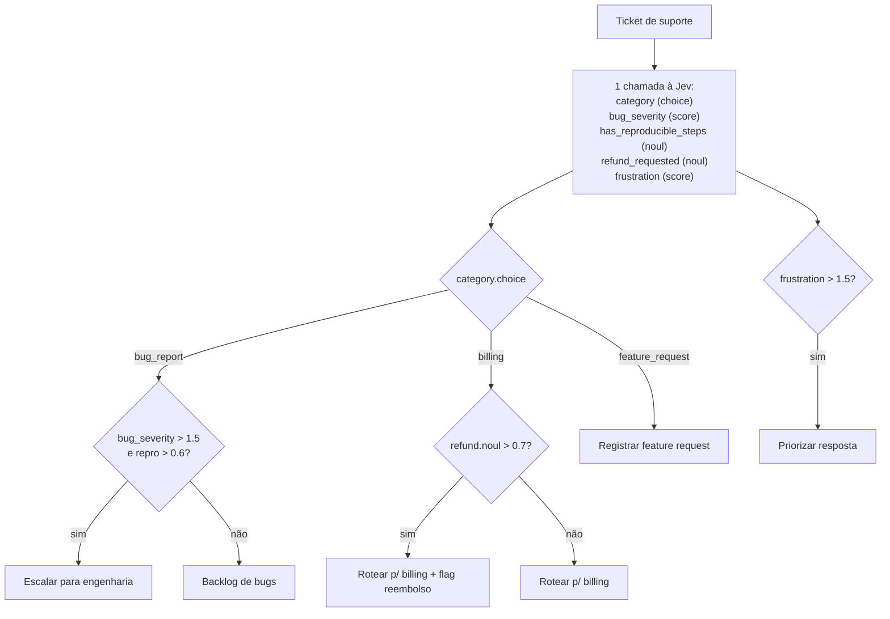
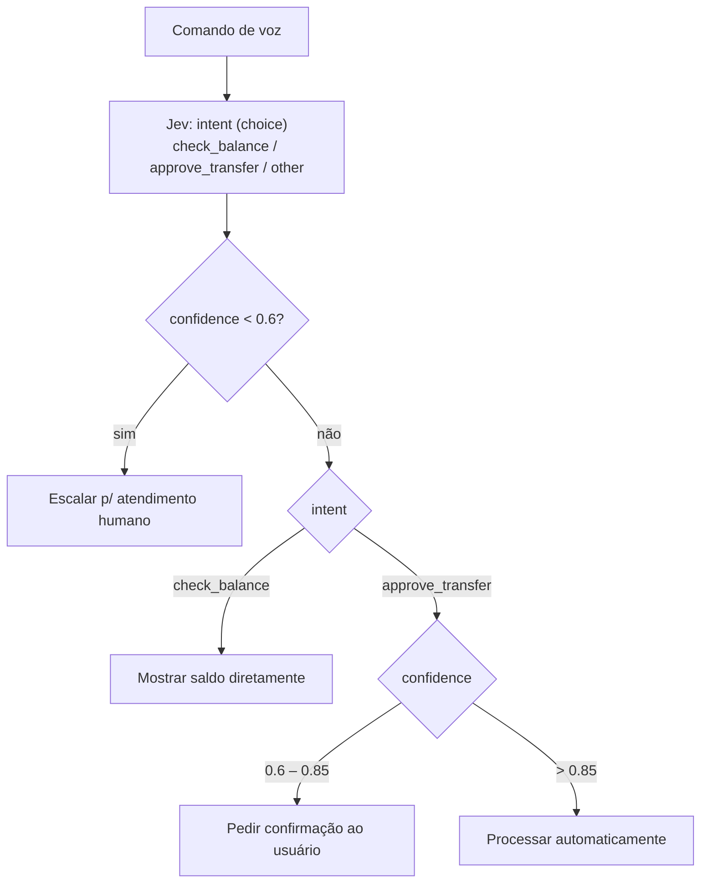
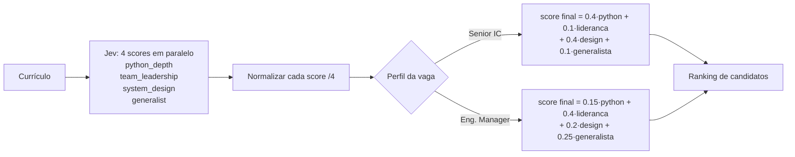
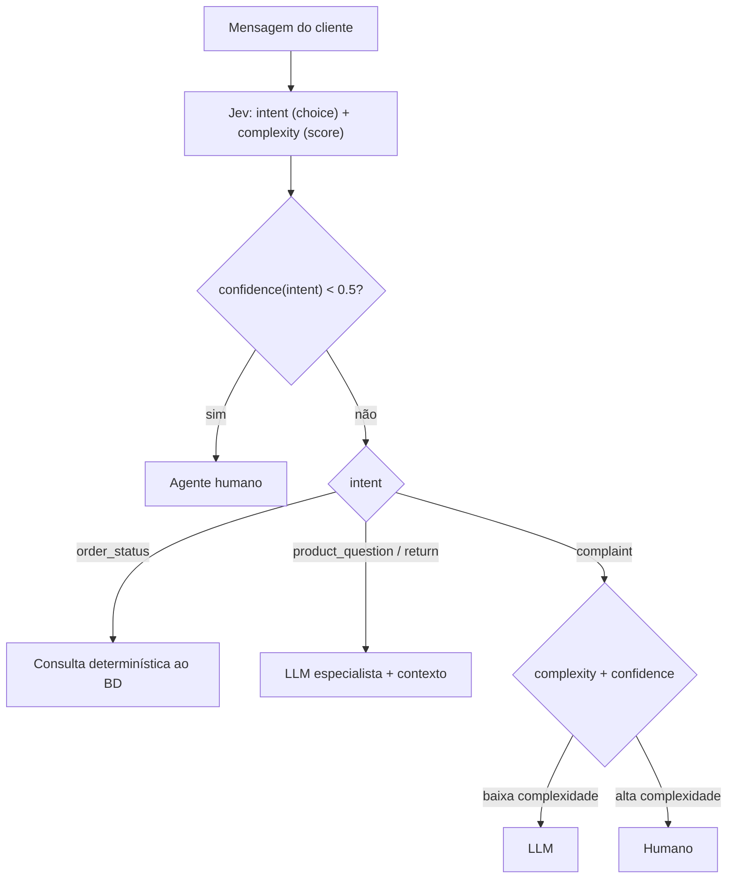

# Jev — Padrões e Cookbooks

## 1. Introdução: por que padrões de composição importam

A Jev é um [System One Model](../sources/blog-introducing-system-one-and-jev.md): um modelo de decisão rápido e reflexo que recebe um `state` (contexto) mais um conjunto de perguntas estruturadas e devolve, para cada pergunta, um de três tipos de resposta — `choice` (escolha entre opções, com probabilidade por opção), `score` (nota numa escala definida por critérios) ou `noul` (probabilidade 0–1 de que uma afirmação seja verdadeira). Ela nunca devolve texto livre.

Esse contrato deliberadamente estreito é a fonte da força da Jev (latência de 70–500ms, previsibilidade, baixo custo — $42/bilhão de tokens de input, output grátis), mas também significa que nenhuma decisão de negócio complexa é resolvida por uma única chamada isolada. Uma decisão real — "esse chamado de suporte deve escalar?", "essas duas entidades são o mesmo produto?", "essa mensagem deve ser bloqueada?" — quase sempre depende de combinar várias respostas atômicas (`choice`/`score`/`noul`) com lógica determinística em código.

É exatamente aí que entram os **padrões de composição**: formas repetíveis de organizar perguntas, thresholds e ramificações de código em torno dos primitivos da Jev, transformando respostas atômicas em decisões de sistema completas. A documentação oficial da TypeSafe descreve isso assim: "Learning to think in terms of discrete, atomic decisions that compose into complex system behavior is a key skill for getting the most out of TypeSafe" ([Patterns — índice](../sources/patterns-index.md)).

Este documento cobre os **4 padrões centrais** documentados pela TypeSafe, os **demos** que os ilustram em código real, e um catálogo de **18 cookbooks** — receitas prontas que aplicam esses padrões a problemas concretos (triagem, extração, guardrails, ranking, RAG, etc).

| Padrão | O que faz | Benefícios |
| --- | --- | --- |
| Speculative Fan-Out | Envia várias perguntas (inclusive especulativas) numa única chamada e deixa o código decidir o que é relevante | Custo, Velocidade |
| Confidence-Gated Routing | Usa a confiança como segundo eixo de decisão para sistemas mais seguros | Confiabilidade, Segurança |
| Composite Scoring | Combina várias dimensões de análise num único score | Custo, Confiabilidade, Velocidade |
| Intent Routing | Classifica a intenção do usuário e roteia para o handler apropriado | Custo, Velocidade |

Fonte: [Patterns — índice](../sources/patterns-index.md).

## 2. Os 4 padrões centrais

### 2.1 Speculative Fan-Out

**Problema que resolve:** evitar múltiplas idas e vindas (round-trips) quando uma decisão depende de perguntas condicionais — por exemplo, "qual a severidade do bug?" só importa se a categoria for `bug_report`. Perguntar sequencialmente (primeiro a categoria, depois a severidade em outra chamada) multiplica latência e custo.

**Como funciona:** como a Jev avalia todas as perguntas de uma chamada em paralelo, o custo marginal de adicionar mais perguntas é baixo. A recomendação é enviar **todas** as perguntas que o sistema pode precisar — inclusive as "especulativas", que só farão sentido dependendo da resposta de outra pergunta — numa única chamada, e deixar o código decidir depois o que é relevante e o que deve ser descartado ([Speculative Fan-Out](../sources/patterns-fan-out.md)).



Exemplo de código (triagem de tickets de suporte), reproduzido da fonte:

```python
category = response.answers["category"]
bug_severity = response.answers["bug_severity"]
bug_repro = response.answers["has_reproducible_steps"]
refund = response.answers["refund_requested"]
frustration = response.answers["frustration"]

if category.choice == "bug_report":
    if bug_severity.score > 1.5 and bug_repro.noul > 0.6:
        escalate_to_engineering(ticket_id, severity="high")
    else:
        add_to_bug_backlog(ticket_id)

elif category.choice == "billing":
    if refund.noul > 0.7:
        route_to_billing_with_flag(ticket_id, refund_likely=True)
    else:
        route_to_billing(ticket_id)

elif category.choice == "feature_request":
    log_feature_request(ticket_id)

if frustration.score > 1.5:
    flag_for_priority_response(ticket_id)
```

Fonte: [Speculative Fan-Out](../sources/patterns-fan-out.md).

### 2.2 Confidence-Gated Routing

**Problema que resolve:** ações com consequências muito diferentes (consultar um saldo vs. aprovar uma transferência) não deveriam exigir o mesmo nível de certeza do modelo. Usar um único threshold de confiança para tudo é arriscado — ou fica permissivo demais para ações críticas, ou trava demais ações triviais.

**Como funciona:** a resposta da Jev diz **o quê** (a escolha em si); a confiança diz **se** deve agir com base nela. O padrão consiste em definir thresholds de confiança diferentes por ação, proporcionais ao risco de cada uma ([Confidence-Gated Routing](../sources/patterns-confidence-routing.md)).

No exemplo de comandos de voz bancários:
- Confiança abaixo de 0.6 → escalar para atendimento humano (piso genérico para incerteza real)
- `check_balance` com confiança ≥ 0.6 → mostrar saldo diretamente (ação de baixo risco)
- `approve_transfer` entre 0.6 e 0.85 → pedir confirmação ao usuário
- `approve_transfer` acima de 0.85 → processar automaticamente (ação de alto risco exige mais certeza)



Fonte: [Confidence-Gated Routing](../sources/patterns-confidence-routing.md).

### 2.3 Composite Scoring

**Problema que resolve:** julgamentos complexos e multidimensionais (por exemplo, avaliar um currículo para uma vaga) não devem ser reduzidos a um único julgamento monolítico do modelo — isso torna o resultado opaco e impossível de recalibrar sem reprocessar tudo.

**Como funciona:** quebrar o julgamento em dimensões atômicas e independentes, pedir um `score` para cada uma, e combinar os scores com **pesos controlados em código** — não pelo modelo. Isso dá transparência total: se os melhores candidatos não fazem sentido, basta ajustar os pesos, sem perder a granularidade de cada dimensão ([Composite Scoring](../sources/patterns-composite-scoring.md)).

No exemplo de triagem de currículos para vagas de engenharia, quatro dimensões são avaliadas em paralelo (escala 0–4, depois normalizada para 0–1):

| Dimensão | Peso — Senior IC | Peso — Engineering Manager |
| --- | --- | --- |
| Profundidade em Python | 40% | 15% |
| Liderança de equipe | 10% | 40% |
| Design de sistemas | 40% | 20% |
| Capacidade generalista | 10% | 25% |



Fonte: [Composite Scoring](../sources/patterns-composite-scoring.md).

### 2.4 Intent Routing

**Problema que resolve:** processar toda requisição por um handler caro (LLM generativa completa, ou humano) desperdiça custo e velocidade em casos que poderiam ser resolvidos de forma mais barata e determinística.

**Como funciona:** a Jev funciona como uma camada de classificação **antes** de qualquer handler — ela decide qual é a melhor forma de resolver a requisição: lógica determinística, uma LLM especialista, ou um humano. No exemplo de atendimento ao cliente, duas perguntas são avaliadas em paralelo: `intent` (choice: order status / dúvida de produto / troca-devolução / reclamação) e `complexity` (score) ([Intent Routing](../sources/patterns-intent-routing.md)).

Lógica de roteamento:
- Confiança de intenção abaixo de 0.5 → agente humano
- `order status` → consulta determinística ao banco de dados
- Dúvidas de produto / trocas → LLM especialista com contexto relevante
- Reclamações → score de complexidade + confiança decidem entre LLM ou humano



Fonte: [Intent Routing](../sources/patterns-intent-routing.md).

## 3. Demos: padrões de uso real

A TypeSafe mantém uma seção de demos interativos ilustrando os padrões acima em aplicações completas ([Demos — índice](../sources/demos-index.md)).

### Smart Home Assistant Demo

O demo de assistente de casa inteligente é uma implementação viva do padrão **Speculative Fan-Out** combinado com fallback para uma LLM generativa. Para um pedido como *"Turn off all of the lights in the house"*, o sistema dispara em paralelo quatro perguntas — categoria do pedido, domínio-alvo, tipo de dispositivo e ação necessária — mesmo antes de confirmar quais são de fato relevantes; as respostas irrelevantes são descartadas depois, em código ([Smart Home Assistant Demo](../sources/demos-smart-home.md)).

O demo também evidencia dois refinamentos importantes sobre o padrão puro de fan-out:

- **Tratamento de pedidos compostos:** quando o sistema detecta múltiplas ações distintas num único pedido do usuário, uma LLM é usada para dividir o pedido em comandos individuais, que então são avaliados separadamente pela Jev.
- **Fallback conversacional:** para pedidos que são, na verdade, perguntas abertas de informação (não comandos), o sistema delega para uma LLM generativa — mantendo respostas determinísticas rápidas para comandos, mas preservando flexibilidade para o que não se encaixa no formato `choice`/`score`/`noul`.

Isso demonstra um ponto central da arquitetura de produção: a Jev **não substitui** LLMs generativas — ela atua como uma camada de decisão rápida e barata que resolve o caso comum determinísticamente, empurrando apenas os casos genuinamente abertos para um modelo mais caro.

O demo é implementado como uma aplicação Vite/React consumindo a API da TypeSafe.

## 4. Cookbooks

A TypeSafe documenta 18 cookbooks (receitas) que aplicam os primitivos e padrões acima a problemas concretos ([Cookbooks — índice](../sources/cookbook-index.md)).

| Cookbook | Problema que resolve | Primitivo(s) usado(s) | Ideia central |
| --- | --- | --- | --- |
| [Self-Consistency: Nouls](../sources/cookbook-consistency-noul.md) | Triagem de sinistros de seguro exige probabilidades confiáveis em decisões-limítrofes | `noul` | Rubrica de 14 perguntas repetida entre modelos; Jev tem variância muito menor (desvio-padrão médio 0.0102) que LLMs padrão, permitindo escalar só os casos realmente incertos (0.30–0.70) para revisão humana |
| [Self-Consistency: Choices](../sources/cookbook-consistency-choice.md) | Decisões de moderação de conteúdo "oscilam" entre chamadas repetidas ao mesmo post limítrofe | `choice` | Rubrica de 8 perguntas rodada 15x; com threshold de 0.60 a Jev atinge 99.2% de concordância de decisão, com 74.2% dos casos resolvidos automaticamente |
| [Parallel Questions](../sources/cookbook-parallel-questions.md) | Perguntas separadas sobre o mesmo documento multiplicam custo e latência | `noul`, `choice`, `score` | Agrupar todas as perguntas numa única chamada dá respostas idênticas às chamadas individuais, com 12.2x menos custo e 10x menos latência |
| [Re-ranking](../sources/cookbook-rerank.md) | Busca por palavra-chave (BM25) traz uma shortlist, mas a ordem de relevância real está errada | `noul` | BM25 filtra rápido para ~30 candidatos; Jev responde uma pergunta sim/não por par consulta-candidato, convertida em score 0–1 para reordenar — subiu top-1 accuracy de 5% para 18% |
| [Semantic Find](../sources/cookbook-semantic-find.md) | Buscar semanticamente dentro de um documento grande (até 255 linhas) e saber quando a resposta simplesmente não existe | `choice`, `noul` | Uma pergunta `choice` rankeia linhas por relevância; uma pergunta `noul` separada confirma se a resposta de fato existe no documento |
| [Autoformat (Structure Recovery)](../sources/cookbook-autoformat.md) | Texto colado perdeu formatação Markdown (quebras de linha erradas, sem cabeçalhos/listas) | `noul`, `choice` | Pipeline de 2 passagens: `noul` decide se linhas adjacentes devem ser unidas; `choice` classifica cada bloco final (título, parágrafo, lista, código, etc) |
| [Function Calling](../sources/cookbook-function-calling.md) | Converter linguagem natural em chamadas de função tipadas, com argumentos de conjunto fechado | `choice`, `noul` | Cada argumento vira uma pergunta com opções descritas em linguagem natural; a confiança reportada é a do argumento menos certo da chamada, não um produto de probabilidades |
| [Skill Suggestion](../sources/cookbook-skill-suggestion.md) | Agente com 182+ skills erra a seleção porque descrições truncadas parecem idênticas | `choice`, `noul` | Duas rodadas de progressive disclosure: `choice` amplo rankeia todas as skills e é filtrado por 3 `noul` de gate; top-3 são reavaliadas com descrição completa — reduz carregamentos errados de 16.8% para 7.3% |
| [Entity Alignment](../sources/cookbook-entity-alignment.md) | Decidir se dois registros de fontes diferentes são o mesmo produto (merge, descartar, ou escalar) | `score`, `noul` | Um `score` de 3 níveis semânticos (diferente / relacionado / mesmo produto) resolve o julgamento principal; `noul`s por campo dão detalhe para curadoria humana |
| [Classifying RAG Passages](../sources/cookbook-classifying-rag-passages.md) | Passagens recuperadas num pipeline RAG trazem ruído, irrelevância ou contradição | `noul` | Estágio de classificação entre retrieval e geração: 4 perguntas `noul` (relevância, evidência utilizável, contradição, tentativa de prompt injection) decidem incluir, sinalizar como conflitante, ou excluir cada passagem |
| [Citation Check](../sources/cookbook-citation-check.md) | Verificar se citações geradas por LLM são reais e realmente suportam a afirmação feita | `choice` | Correspondência exata de string localiza a citação no texto-fonte; `choice` classifica a relação (supports / contradicts / says_nothing) — mapeada para verified / contradicted / unsupported / fabricated |
| [LLM Guardrails](../sources/cookbook-llm-guardrails.md) | Fronteiras de segurança de LLMs são inconsistentes entre modelos e vulneráveis a jailbreaks | `noul`, `score` | Uma única chamada avalia toda mensagem (entrada e saída): 4 `noul`s de risco (jailbreak, crime, conselho médico, automutilação) + 1 `score` de severidade (0–3); roteamento por thresholds configuráveis por política de produto |
| [SDE Cascade](../sources/cookbook-sde-cascade.md) | Extração estruturada de alta qualidade custa caro se sempre usar modelo forte de raciocínio | `noul` | Cascata de 3 estágios: modelo barato extrai → Jev verifica cada campo com `noul` de probabilidade de erro → só registros sinalizados escalam para modelo caro |
| [Date Extraction](../sources/cookbook-date-extraction.md) | Extrair e validar datas absolutas ("14 de agosto de 2027") e relativas ("próxima quinta") | `choice` | 7 perguntas `choice` por extração (modo, mês, dia, ano, âncora, dia da semana, deslocamento de semana); código resolve isso em data concreta + score de confiança |
| [Pre-parsed Value Extraction](../sources/cookbook-pre-parsed-value-extraction.md) | Extrair valores estruturados (e-mail, telefone, valores) sem risco de alucinação | `choice`, `noul` | Regex localiza candidatos primeiro; Jev só escolhe entre os spans encontrados pelo regex — o valor devolvido é sempre um span copiado, nunca inventado |
| [Hierarchical Classification](../sources/cookbook-hierarchical-classification.md) | Classificar documentos em taxonomias profundas (patentes, produtos, temas biomédicos) sem que um erro raso condene toda a árvore | `choice` | Beam search paralelo (K=3) usando média geométrica das probabilidades de aresta supera a seleção gulosa top-1 — 4/4 corretas vs. 2/4 nos testes |
| [Autoresearch Feature Discovery](../sources/cookbook-autoresearch-feature-discovery.md) | Converter texto não-estruturado (notas de degustação) em features numéricas para ML sem engenharia manual | `score`, `noul` | Loop iterativo: propõe perguntas → Jev responde numericamente → treina modelo supervisionado → usa os erros para refinar as perguntas; RMSE caiu de 2.15 para 1.77 em 5 rodadas |
| [Classification using Confidence](../sources/cookbook-classification-using-confidence.md) | Classificar relatórios anuais da SEC em 75 grupos industriais sem forçar falsa precisão quando o modelo está incerto | `choice` | Confiança ≥ 0.9 → reporta o grupo específico; abaixo disso → reporta a divisão mais ampla. Em 60 relatórios, a metade acima de 0.9 acerta 90%; a outra metade acerta 40% no grupo e 70% quando reportada na divisão |

### Aprofundando: 5 cookbooks representativos

**SDE Cascade** ilustra o padrão de **cascata de custo**: em vez de escolher entre um modelo barato (rápido, mas impreciso) e um modelo caro (preciso, mas lento/custoso) para *toda* extração, o cookbook usa o modelo barato para extrair e a Jev para **verificar cada campo extraído** com uma pergunta `noul` de probabilidade de alucinação — só os campos sinalizados escalam para o modelo caro. O schema de extração e a pergunta de verificação (reproduzidos da fonte):

```json
{
  "properties": {
    "registration_open_date": {
      "description": "Date in mm/dd/yyyy format",
      "type": "string"
    }
  },
  "required": ["registration_open_date"]
}
```

```python
questions[f"{name}::hallucinated"] = Noul(
    instructions={...},
    criteria=NoulCriteria(
        true="the value is unsupported by source text",
        false="the value is supported by source text"
    )
)
```

**Skill Suggestion** resolve um problema muito próximo do que este próprio agente vive todos os dias: escolher a skill certa entre uma lista enorme, quando descrições truncadas tornam opções indistinguíveis. A solução usa **duas rodadas de progressive disclosure** — a primeira faz um `choice` amplo sobre todas as skills, gateado por 3 perguntas `noul`; a segunda reavalia só o top-3 com descrição completa:

```python
def suggest(request: str) -> tuple[str, ...]:
    wide = rank_wide(request)
    if wide["gate"] < GATE_THRESHOLD:
        return ()
    shortlist = tuple(name for name, _ in wide["ranked"][:SHORTLIST])
    result = rerank(request, shortlist, EXCERPT_CHARS)
    if max(result["fits"].values()) < FITS_THRESHOLD:
        return ()
    return (result["winner"],)
```

**LLM Guardrails** aplica **Confidence-Gated Routing** (padrão da seção 2.2) à moderação de segurança: uma única chamada com 4 `noul`s de risco + 1 `score` de severidade decide se a mensagem passa, vai para revisão, é bloqueada, ou aciona suporte — com thresholds diferentes por política de produto:

```python
def guard(text: str, side: str, policy_name: str = DEFAULT_POLICY) -> str:
    """Screen a message and route it under a named application policy."""
    result = screen(text, side)
    return route(result["nouls"], result["severity"], POLICIES[policy_name])
```

**Hierarchical Classification** mostra que **Speculative Fan-Out** também se aplica dentro de uma árvore de decisão: em vez de escolher gulosamente (top-1) em cada nível da taxonomia, o cookbook avalia múltiplos caminhos em paralelo (beam search K=3), pontuando cada caminho pela média geométrica das probabilidades de aresta — o que corrige decisões ambíguas tomadas cedo demais. Resultado: 4/4 classificações corretas contra 2/4 do método guloso.

**Pre-parsed Value Extraction** combina regex determinístico com `choice` da Jev para eliminar alucinação por construção: o regex encontra os candidatos possíveis no texto, e a Jev **só pode escolher entre eles** — nunca inventa um valor novo:

```python
def pick(document: str, candidates: list[str], question: str) -> dict:
    criteria = {c: None for c in candidates} | {NONE: "None of these is the requested value."}
    answer = ts.system_one(
        state=document,
        questions={"pick": Choice(instructions=question, criteria=criteria)},
        model=TYPESAFE_MODEL,
    ).answers["pick"]
    return {"choice": answer.choice, "confidence": answer.confidence}
```

## 5. Referências

Todas as afirmações factuais acima foram fundamentadas nos seguintes documentos-fonte locais, ingeridos a partir da documentação oficial da TypeSafe:

- [Introducing System One Models & Jev](../sources/blog-introducing-system-one-and-jev.md)
- [Patterns — índice](../sources/patterns-index.md)
- [Speculative Fan-Out](../sources/patterns-fan-out.md)
- [Confidence-Gated Routing](../sources/patterns-confidence-routing.md)
- [Composite Scoring](../sources/patterns-composite-scoring.md)
- [Intent Routing](../sources/patterns-intent-routing.md)
- [Demos — índice](../sources/demos-index.md)
- [Smart Home Assistant Demo](../sources/demos-smart-home.md)
- [Cookbooks — índice](../sources/cookbook-index.md)
- [Self-Consistency: Nouls](../sources/cookbook-consistency-noul.md)
- [Self-Consistency: Choices](../sources/cookbook-consistency-choice.md)
- [Parallel Questions](../sources/cookbook-parallel-questions.md)
- [Re-ranking](../sources/cookbook-rerank.md)
- [Semantic Find](../sources/cookbook-semantic-find.md)
- [Autoformat (Structure Recovery)](../sources/cookbook-autoformat.md)
- [Function Calling](../sources/cookbook-function-calling.md)
- [Skill Suggestion](../sources/cookbook-skill-suggestion.md)
- [Entity Alignment](../sources/cookbook-entity-alignment.md)
- [Classifying RAG Passages](../sources/cookbook-classifying-rag-passages.md)
- [Citation Check](../sources/cookbook-citation-check.md)
- [LLM Guardrails](../sources/cookbook-llm-guardrails.md)
- [SDE Cascade](../sources/cookbook-sde-cascade.md)
- [Date Extraction](../sources/cookbook-date-extraction.md)
- [Pre-parsed Value Extraction](../sources/cookbook-pre-parsed-value-extraction.md)
- [Hierarchical Classification](../sources/cookbook-hierarchical-classification.md)
- [Autoresearch Feature Discovery](../sources/cookbook-autoresearch-feature-discovery.md)
- [Classification using Confidence](../sources/cookbook-classification-using-confidence.md)

**Nota de honestidade:** todas as 26 URLs solicitadas (7 da Parte A + 19 da Parte B) foram acessadas com sucesso via WebFetch e ingeridas como documentos-fonte locais antes de serem citadas aqui. Nenhuma página retornou 404 ou vazio. Os cookbooks da Parte B foram capturados em versão resumida (título, problema, primitivo(s), ideia central e trecho de código/schema), conforme instruído, para não estourar o orçamento de contexto — não como texto integral verbatim.
